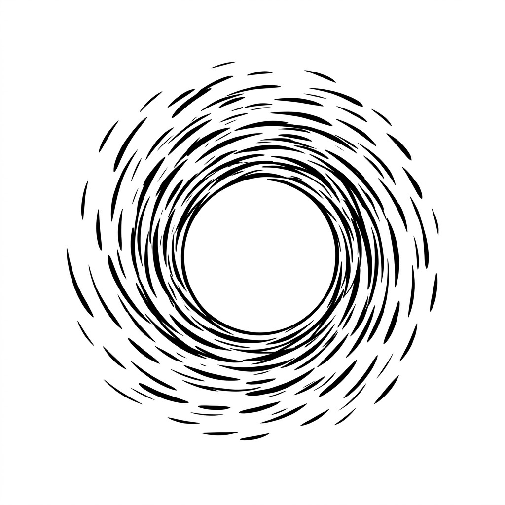

<div align="center">
  
  <h1>Aughor</h1>
  <p><strong>Autonomous Intelligence Platform</strong></p>
  <p><em>Your warehouse, always thinking.</em></p>
</div>

---

Aughor is an **Autonomous Intelligence Platform** that connects to your database and never stops learning from it. It builds a living map of your business — entities, relationships, metrics, lifecycles — and uses that map to answer hard analytical questions in plain English.

No dashboards to maintain. No SQL to write. No analyst backlog.

---

## Why Aughor

Most AI data tools are query wrappers — you ask, they translate. Aughor goes further: it **explores your data continuously in the background**, forming a business ontology, surfacing domain insights, and staying ready to answer any question with full evidence, citations, and statistical confidence.

| | SQL Copilots | BI Tools | **Aughor** |
|---|---|---|---|
| Understands schema automatically | ⚠️ Partial | ❌ Manual | ✅ |
| Explores data on its own to learn your business | ❌ | ❌ | ✅ |
| Answers business questions with evidence | ❌ | ❌ | ✅ |
| Knows entity lifecycles & business rules | ❌ | ❌ | ✅ |
| Builds a living ontology from real data | ❌ | ❌ | ✅ |
| Self-corrects SQL errors | ❌ | ❌ | ✅ |
| Runs fully local | ⚠️ Some | ❌ | ✅ |

---

## Features

### Autonomous Background Exploration

The moment you connect a database, Aughor starts exploring — silently, in the background, without any prompts. It works through a structured sequence of phases:

| Phase | What it does |
|---|---|
| **Null meaning resolution** | Distinguishes "event not yet occurred" from "data quality gap" for every nullable column |
| **Join verification** | Validates FK relationships and measures referential integrity |
| **Lifecycle mapping** | Extracts state machines for entity tables (orders: pending → shipped → delivered → returned) |
| **Distribution profiling** | Detects skew, outliers, and shape for numeric columns using DB-native catalog stats — no full-table scans |
| **Cross-table pattern discovery** | Finds correlated columns, shared value sets, and structural anomalies across tables |
| **Domain intelligence** | Adaptive curiosity loop per business domain (Commerce, Finance, Operations, Marketing) with novelty decay |

All exploration phases are scoped to a **12-month time window** — automatically computed from the latest timestamp in your schema, so insights are always about recent data.

### Business Ontology — Auto-Built

Aughor builds a **queryable business ontology** from your schema, not from documentation you write:

- **Entities** — `Customer`, `Order`, `Product` — mapped to source tables with descriptions, grain, and domain assignment
- **Relationships** — `Customer places Order` — with inferred cardinality and join paths
- **Metrics** — revenue, AOV, retention rate — as semantic contracts with governance (owner, SLA, quality tests, lineage)
- **Lifecycle states** — terminal vs. active states per entity, extracted from real data distributions; false-positive guards reject geographic codes, formula strings, and description columns so only genuine process stages appear
- **Actions** — deterministic SQL templates generated from entity relationships

The ontology is displayed as an interactive canvas and refreshes automatically.

### Chat — Answer First, Explain Later

Ask anything in plain English. Aughor writes SQL, runs it, interprets the result, and streams back a structured answer with:

- **Auto-charts** — time series, bar, grouped-bar, scatter — chosen automatically via `inferChartType()`
- **Thinking trace** — every reasoning step, SQL draft, and correction visible
- **Statistical layer** — STL decomposition, z-score anomaly detection, Mann-Whitney significance tests
- **Self-correction** — reads actual errors (DuckDB candidate column bindings included), resolves aliases, retries
- **Citation pinning** — every claim linked to the exact SQL that produced it

Chat sessions are persisted and fully restorable from history.

### Investigative Mode — Evidence-Based Answers

For complex questions ("Why did revenue drop 8% last month?"), Aughor runs a full LangGraph investigative loop:

1. **Decompose** — break the question into sub-hypotheses
2. **Plan & Execute** — write and run SQL for each hypothesis
3. **Score Evidence** — weight findings by statistical confidence and sample size
4. **Synthesise** — produce a structured report with ranked hypotheses, supporting data, and caveats
5. **Evidence Ledger** — every claim stored with confidence, SQL source, metric used, and data freshness; thumbs up/down feedback loop

Investigations are resumable — pause mid-run, switch tabs, come back later.

**Cross-sectional diagnostics.** Vague-but-critical questions ("where are we losing money?", "which region is weakest?") have no time axis — Aughor detects these and runs a **dimensional weakness scan** (rank the money metric across franchise / region / product / segment, surface the lowest and most-concentrated values) instead of forcing a temporal anomaly frame.

**Data-shape aware.** Framing reads the data's actual shape — numeric distributions (median/IQR), an auto-derived time grain (daily vs weekly vs quarterly from span + cadence), incomplete-trailing-period detection, and comparison windows clamped to data that actually exists — so it never compares against an empty period or reports a partial month as a crash.

**The Brief.** Both Insight and Deep Analysis render as a clean single-column analytical brief — prose leads with the answer and bolds the key numbers, charts/tables are the only framed blocks, and the SQL/confidence/attribution machinery folds into one quiet "details" disclosure.

### Grounded NL2SQL — Trustworthy Generation

Aughor doesn't just hand the schema to an LLM and hope. Every question runs through a grounding pipeline that narrows, structures, and verifies context so the model generates correct SQL on schemas it has never seen:

1. **Schema-linking** — narrows a large schema to the tables/columns relevant to *this* question (with a safety floor that never returns an empty schema)
2. **Data Catalog** — a structured, MindsDB-style catalog of the linked tables: exact columns, types, sample rows, and detected foreign-key joins
3. **Foreign-key & star-schema join grounding** — detects FK relationships even with prefixed/fused keys (`c_custkey ↔ o_custkey`), surrogate keys (`ss_item_sk ↔ i_item_sk`), and role-played date dimensions; routes facts → dimensions (not fact↔fact); pulls in bridge tables a multi-join question needs only via a join
4. **Temporal/dimension grounding** — for star schemas, brings the `date_dim`/`time_dim` into context and tells the model that `*_date_sk` columns are surrogate keys to join, not literals
5. **Trusted query templates** — data-team-reviewed verified SQL patterns; when a question matches one it's injected authoritatively ("reuse this exact structure"), fixing reasoning gaps prompt rules can't (e.g. multi-fact **fan-out**). Answers are marked **Verified**
6. **Metrics catalog** — approved KPI formulas with governance, filtered to the connection's schema
7. **Exploration findings, causal edges, documents, org intelligence, KB patterns, prior SQL examples** — the wider knowledge layers
8. **Dialect normalization + self-correcting retry** — SQLGlot transpiles to the target dialect; on an error the failure is diagnosed (DuckDB-specific hints for `to_char`, `date_part`, etc.) and the query is rewritten

This pipeline is benchmark-validated (see **Eval Suite** below) on real, unseen schemas — TPC-H, TPC-DS, ClickBench, and live warehouses.

### Connectors & Federation

**Databases:** DuckDB, PostgreSQL  
**Warehouses:** BigQuery, Snowflake, MySQL  
**Files:** Local upload (CSV/Parquet/Excel), S3  
**Google Sheets:** link-shared sheets via the public gviz CSV export, read into DuckDB (with a cross-request cache)  
**API/CRM:** Stripe, HubSpot, Salesforce  
**Knowledge:** Confluence, Notion  
**Federation:** Virtual federated database across multiple connections — tables exposed as `{conn_id}__{table}`

Connections are **pooled** — open handles are reused across requests (exclusive checkout, idle TTL, health checks) so Postgres/warehouse auth and Sheets fetches aren't repaid on every query. All credentials encrypted at rest with Fernet symmetric encryption. New connections kick off background exploration automatically (visible and cancellable).

### Semantic Layer

- **Business Glossary** — YAML file with table descriptions, grain, column definitions, join hints, and caveats
- **Auto-Seed** — LLM auto-generates descriptions for unannotated tables on first schema load (idempotent)
- **dbt Integration** — reads `manifest.json` for model descriptions and column-level metadata
- **Metrics Catalog** — named business metrics with formulas, governance fields, quality tests, freshness SLA
- **SQL Knowledge Base** — curated pattern library injected as context for SQL generation

### Visual Query Builder

Full visual query builder in the UI:
- Table selector with schema discovery, column type indicators
- Dimensions (GROUP BY) + Measures (aggregations) + Filters
- Metrics Catalog integration — add pre-built KPIs as measures
- Live SQL preview — auto-generated, editable (disconnects from builder when manually edited)
- Results with charts, row count, timing, cached badge

### Eval Suite — Measured on Real, Unseen Schemas

NL2SQL quality is validated against real benchmarks with ground-truth, not vibes (`evals/`):

| Harness | Schema | How it's scored | Result |
|---|---|---|---|
| `run_tpch.py` | TPC-H (6M rows, 8-table joins) | execution vs DuckDB's bundled official queries | 5/7 |
| `run_tpcds.py` | TPC-DS (2.88M rows, 24-table snowflake) | execution vs `tpcds_queries()` | 4/5 |
| `run_clickbench.py` | ClickBench (105-column wide table) | execution vs verbatim reference | 10/10 |
| `run_golden.py` | full-pipeline + 53-question golden set | measure-based result comparison | — |
| `run_realdb.py` | **any live connection** | reference-free: executes-clean + **self-consistency** + cross-model **LLM-as-judge** | ~11/15 |

- **Generated SQL runs through the full grounding pipeline** (`--full-pipeline`), so the number reflects the product, not a bare model.
- **Reference-free scoring** (`run_realdb.py`) is the plug-and-play test: it auto-generates business questions from a live schema, then scores with no hand-written reference SQL — the basis for a per-answer **confidence score**.
- **Model-agnostic** via `AUGHOR_CODER_MODEL` (validated with qwen3-coder and kimi-k2.6).

### Observability & Security

- **Langfuse + OpenTelemetry** tracing — `@node_span` on all investigation nodes; `trace_id` in SSE start event
- **Security baseline** — SQL safety checker, PII scanner, audit log (append-only SQLite WAL), query budget enforcement; internal/metadata queries are excluded from the audit trail
- **Anthropic fallback** — if the primary LLM backend (local/cloud Ollama) fails, generation transparently retries on Anthropic (Opus) when an API key is configured
- **Action Hub** — webhook/Slack/Jira triggers from investigation recommendations

### Design System

- Dark-first Palantir Blueprint design tokens throughout
- CSS custom properties for all palette, chart, and spacing values — single source of truth
- **Single-source components** — ERD, Chart, Ontology, and Table each exist once, on a canonical contract, callable anywhere; shared `web/lib/{format,palette,tableName}` primitives so a formatting, colour, or table-name fix lands once and propagates everywhere
- Type scale utilities: `.aug-text-h1/h2/h3`, `.aug-text-ui/sm/xs`, `.aug-text-mono`
- Command palette (⌘K) — fuzzy search across navigation, recent investigations, schema tables
- Ask Hero — centered textarea with mode toggle, stat strip, and recent investigation cards

---

## Stack

| Layer | Technology |
|---|---|
| Backend | Python 3.11+, FastAPI, LangGraph |
| Frontend | Next.js 16 (App Router, Turbopack), TypeScript, Tailwind |
| Analytics | DuckDB, PostgreSQL |
| LLM Runtime | Ollama / Groq / Together / Anthropic |
| Statistics | scipy, statsmodels, numpy |
| SQL Parsing | SQLGlot |
| Vector Search | Qdrant + ChromaDB |
| Observability | Langfuse, OpenTelemetry |
| State | SQLite (history, registry, evidence ledger, audit log) |
| Packaging | uv |

---

## Quick Start

### Prerequisites

- Python 3.11+
- [uv](https://docs.astral.sh/uv/) (`pip install uv`)
- Node.js 18+ and npm
- [Ollama](https://ollama.com/) with your model of choice pulled

### 1. Clone & install

```bash
git clone https://github.com/sidhasadhak/aughor.git
cd aughor

# Install Python deps
uv sync

# Install frontend deps
cd web && npm install && cd ..
```

### 2. Configure

```bash
cp .env.example .env
# Edit .env — set your LLM backend and model names
```

Minimal `.env` for local Ollama:

```env
AUGHOR_BACKEND=ollama
AUGHOR_CODER_MODEL=qwen2.5-coder:14b
AUGHOR_NARRATOR_MODEL=qwen2.5-coder:14b
EMBEDDER_BASE_URL=http://localhost:11434/v1
EMBEDDER_MODEL=nomic-embed-text
```

### 3. Start

```bash
./start.sh
```

Open [http://localhost:3000](http://localhost:3000).

### 4. Connect your database

Click **+ Add** in the sidebar → paste a DuckDB file path or PostgreSQL DSN → Save. Aughor starts exploring immediately.

---

## Project Structure

```
aughor/
├── aughor/
│   ├── agent/          # LangGraph investigative loop + ADA phase prompts
│   ├── connectors/     # DuckDB, Postgres, Snowflake, BigQuery, Stripe, Salesforce, …
│   ├── db/             # DatabaseConnection, registry, schema cache, matcache
│   ├── evidence/       # Evidence ledger — claims, confidence, feedback loop
│   ├── explorer/       # Background schema exploration agent (phases 3–8)
│   ├── knowledge/      # Document indexer, Confluence/Notion sync, Org Intelligence
│   ├── llm/            # LLM provider abstraction (Ollama / OpenAI-compatible)
│   ├── ontology/       # Ontology builder, enricher, models, store
│   ├── process/        # Causal graph, process mapper
│   ├── routers/        # 12 FastAPI domain routers (async, run_in_executor)
│   ├── security/       # Safety checker, PII scanner, audit log, query budget
│   ├── semantic/       # Glossary, dbt, embedder, metrics catalog, KB, trusted_queries
│   ├── sql/            # SqlWriter — SQL generation, dialect normalization & self-correction
│   ├── telemetry.py    # Langfuse + OTel tracing
│   ├── tools/          # schema-linker, data_catalog, stats, profiler, semantic_validator
│   └── api.py          # FastAPI entrypoint — REST + SSE
├── evals/              # run_tpch / run_tpcds / run_clickbench / run_golden / run_realdb
├── web/
│   ├── app/            # Next.js App Router — layout, page, globals
│   ├── components/     # 30+ components: ChatPanel, OntologyCanvas, QueryBuilder, …
│   ├── lib/            # api.ts, useChat.ts; format/palette/tableName shared primitives
│   └── styles/         # tokens.css, type.css — design token system
├── scripts/            # smoke.py (GET + Qdrant regression oracle), flows.py (write flows)
├── tests/              # pytest units (e.g. the canonical table-name primitive)
└── data/               # Persisted state (connections, history, episodes, ontology cache)
```

---

## Roadmap

### Shipped

| Sprint | Feature |
|---|---|
| Core | LangGraph investigative loop — decompose → plan → score → synthesise |
| Core | SQL self-correction (SqlWriter) — alias resolution, multi-attempt repair |
| Core | Statistical evidence engine — STL, z-score, Mann-Whitney |
| Core | Two-model architecture — Analyst + Coder LLMs independently configurable |
| Core | Business Glossary + Auto-Seed — YAML semantic layer |
| Core | dbt integration — reads manifest.json |
| Core | Vector search over schema — Qdrant semantic table/column search |
| 21–23 | Canvas — data model, backend CRUD, canvas-aware explorer, promote insights |
| 24 | Security baseline — safety checker, PII scanner, audit log, query budget |
| 25 | Connector framework — BigQuery, Snowflake, MySQL, local upload, S3 |
| 26 | Federation — virtual multi-source DB; Salesforce, HubSpot, Stripe connectors |
| 27 | Knowledge connectors (Confluence, Notion) + Action Hub (webhook/Slack/Jira) |
| 40 | Observability — Langfuse + OTel tracing on all 12 investigation nodes |
| 41 | LLM Evals — golden dataset + Braintrust scorers |
| 42 | Design System Consolidation — CSS token system, type scale, component audit |
| 43 | Navigation + Command Palette (⌘K) + Ask Hero |
| 44 | Evidence Ledger — claim storage, confidence, SQL source, feedback loop |
| 46 | Metrics as Semantic Contracts — governance fields, quality tests, freshness SLA |
| 47 | Charts & Data Visualization Layer — chart type inference, ChartWrapper, tokens |
| 49 | Org Intelligence Layer — promote canvas insights to org-wide knowledge |
| 24b | Async hardening — all 18 blocking DB/LLM route handlers converted to async |
| 24c | Ontology quality — dual-layer lifecycle false-positive detection; geo column exclusion, formula-string guard, avg-length/word-count column-level gate in both builder and explorer merger |
| genie-revamp | **Grounded NL2SQL** — schema-linker (de-hardwired, schema-agnostic), MindsDB-style Data Catalog, FK/star-schema join grounding (prefixed/fused/surrogate keys, fact→dimension routing, FK-neighbour expansion), temporal/dimension grounding, dialect-aware self-correcting retry |
| genie-revamp | **Eval suite** — full-pipeline harness + real-scale TPC-H / TPC-DS / ClickBench harnesses (DuckDB-generated, execution-validated) + reference-free real-DB harness (self-consistency + LLM-judge) |
| genie-revamp | **Trusted query templates** — Databricks-style verified assets; authoritative injection fixes reasoning gaps (fan-out, grain) prompt rules can't |
| genie-revamp | Connection pooling · Google Sheets connector · Anthropic (Opus) fallback · light-mode fix · audit-log noise reduction · LLM-call batching |
| genie-revamp | **Reusable component architecture** — one `<ERDiagram>` / `<Chart>` / `<OntologyGraph>` / `<DataTable>` on canonical contracts; shared `format` / `palette` / `tableName` primitives (backend + frontend); `smoke.py` + `flows.py` test harnesses; ~1,500 lines of duplication removed; 5 bugs fixed, 0 regressions; full `TEST_REPORT.md` |

### Coming Next

| Feature | Why |
|---|---|
| **Motion / animation pass** | Tasteful, performance-conscious transitions throughout — subtle micro-interactions that make the platform feel alive |
| **Trusted-template productization** | UI/explorer flow to curate + review templates per connection; "Verified" trust badge; vector retrieval + typed parameterization |
| **Sprint 48 — Enterprise Hardening** | OAuth2/OIDC, RBAC, workspace tenancy — multi-user ready |
| **Production query timeouts** | Cancel runaway generated queries on real warehouses (a real plug-and-play hazard) |
| **Ontology enrichment sprint** | Close exploration→ontology loop: wire phase 3/5/8 findings back as entity axioms; replace `RELATES_TO` with domain-specific semantic verbs |
| **Column-level lineage** | Trace any value back to its source via SQLGlot parse trees |
| **Drift detection** | Alert when schema, freshness, or value distributions shift |
| **Onboarding experience overhaul** | Guided setup for new users and new connections |

---

## Contributing

Issues and PRs welcome. The codebase is structured to make adding new exploration phases, LLM providers, or database connectors straightforward — each is an isolated module with a clear interface.

---

## License

MIT
