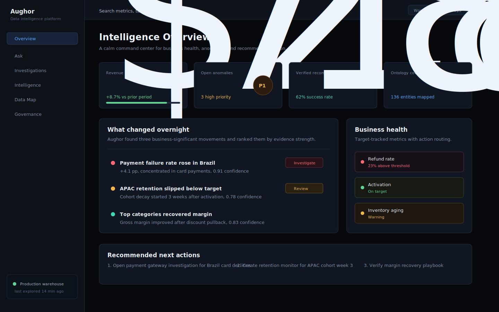

<div align="center">
  
  <h1>Aughor</h1>
  <p><strong>The autonomous intelligence platform for your data warehouse.</strong></p>
  <p><em>Your warehouse, always thinking.</em></p>

  <p>
    
    
    
    
  </p>

  <p>
    <a href="#quick-start"><strong>Quick start</strong></a> ·
    <a href="#whats-inside"><strong>What's inside</strong></a> ·
    <a href="ROADMAP.md"><strong>Roadmap</strong></a> ·
    <a href="FEATURES.md"><strong>Features</strong></a>
  </p>

  
</div>

---

Aughor connects to your database and **never stops learning from it**. It builds a living map of your business — entities, relationships, metrics, lifecycles — explores the data on its own, and answers hard analytical questions in plain English with **evidence, citations, and statistical confidence**.

No dashboards to maintain. No SQL to write. No analyst backlog.

> **The thesis:** most AI data tools are query wrappers — you ask, they translate. Aughor explores *continuously in the background*, forms a business ontology, surfaces domain insights, and is engineered so the numbers it reports are **trustworthy, not just plausible**.

## Why Aughor

- 🔭 **It explores on its own.** The moment you connect, it starts learning your business — no prompts — and keeps a living frontier of what it's already covered.
- 🧠 **It builds an ontology, not a dashboard.** Entities, relationships, governed metrics, and lifecycles, inferred from real data and human-editable.
- 🏭 **It adapts to your industry.** An airline gets load-factor and on-time-performance; a DTC retailer gets AOV and repeat-rate — not one generic lens.
- 🛡 **It refuses to be confidently wrong.** Deterministic, engine-driven trust guards keep fabricated numbers out of every answer.
- 🕰 **It discovers *when* matters.** You never tell it the date range; it anchors the window to the data's own activity.
- 🔌 **It runs fully local.** Your warehouse, your models (Ollama / local / private endpoint) — nothing has to leave your machine.

<details>
<summary><strong>How it compares</strong></summary>

| | SQL Copilots | BI Tools | **Aughor** |
|---|---|---|---|
| Understands the schema automatically | ⚠️ Partial | ❌ Manual | ✅ |
| Explores data on its own to learn your business | ❌ | ❌ | ✅ |
| Answers business questions with evidence + citations | ❌ | ❌ | ✅ |
| Builds a living ontology from real data | ❌ | ❌ | ✅ |
| Adapts metrics to your industry automatically | ❌ | ❌ | ✅ |
| Deterministic guards against wrong numbers | ❌ | ❌ | ✅ |
| Discovers *when matters* (adaptive time window) | ❌ | ❌ | ✅ |
| Runs fully local | ⚠️ Some | ❌ | ✅ |

</details>

---

## Quick start

```bash
git clone https://github.com/sidhasadhak/aughor.git && cd aughor
uv sync                                          # 1. Python deps (DuckDB is built in)
cd web && npm install && cd ..                   # 2. frontend deps
cp .env.example .env                             # 3. then edit: set your LLM backend + models
./start.sh                                       # 4. API :8000 + web → http://localhost:3000
```

Then click **+ Add** in the sidebar → paste a DuckDB path or PostgreSQL DSN → Aughor starts exploring immediately.

<details>
<summary><strong>Minimal local <code>.env</code> (Ollama)</strong></summary>

```env
AUGHOR_BACKEND=ollama
AUGHOR_CODER_MODEL=qwen2.5-coder:14b
AUGHOR_NARRATOR_MODEL=qwen2.5-coder:14b
EMBEDDER_BASE_URL=http://localhost:11434/v1
EMBEDDER_MODEL=nomic-embed-text
```

> **Tip — models are pluggable per role.** SQL generation (`coder`), report synthesis (`narrator`), and the per-phase interpret sub-tier (`fast`) each resolve independently, so you can run a fast structured model for SQL and a stronger model for prose. Set them in `.env`, in `data/llm_config.json` (`models: {coder, narrator, fast}`), or per-agent. Backends: Ollama (local + cloud), Groq, Together, Anthropic, or any private endpoint.

</details>

---

## What's inside

> Seventeen capabilities, one corpus of intelligence. Expand any section for how it works and the trade-offs behind it.

<details>
<summary>🔭 <strong>Autonomous background exploration</strong> — it learns your business with no prompts</summary>

The moment you connect, Aughor starts exploring through structured phases: **null-meaning resolution** (event-not-yet vs data gap), **join verification**, **lifecycle mapping** (state machines per entity), **distribution profiling** (catalog stats, no full scans), **cross-table patterns**, a per-domain **domain-intelligence** curiosity loop, and a closing **synthesis** pass — all visible and cancellable in the Activity log.

**Generation is grounded in your real schema by construction:** the explorer *chooses* measures and dimensions from the connection's *actual* columns and *compiles* grain-safe SQL, so a non-existent column can't be emitted (this took Phase-8 from ~190k tokens per kept finding to several findings per run on a 13-table warehouse). It **builds on what it knows**: a **cut-level frontier** never re-asks a covered measure×dimension cut; a **cross-finding synthesis** pass composes existing findings into emergent insights — *"the top 20 SKUs account for 8.13% of all out-of-stock days"* — each **proven by a confirming query**, not narrated; the org **playbook** steers what to look for next; a surprising finding **drills itself**. An opt-in **manifest-driven mode** (`explorer.manifest_driven`) makes the loop deterministic and KPI-led — **~17× fewer tokens per finding**, completing within budget.

</details>

<details>
<summary>🎛 <strong>Human-command surface</strong> — you keep authority and visibility (AI-FDE-derived)</summary>

Inspired by Palantir Foundry's AI FDE: the human stays in command. All flag-gated + additive, so the default is unchanged. **Close the loop** — captured corrections feed back into planning so a fixed mistake isn't repeated. **Agent context** — an inspectable, editable working set with a live token budget. **Editable plan gate** — deep runs pause after decomposition to review/trim the plan before the expensive fan-out. **Graduated approval + audit** — risk-graded per-action gate under your identity, with a per-scope allowlist and an audit trail. **Declarative modes** — routing/context-scope as editable YAML. **Deployment budget ceiling** — one hard token cap across all agents. **Premise validation** — a "why is X so high" investigation *proves* the premise (subject vs overall/peers) before explaining it. A delta-measurement ratchet gates each change on accuracy + tokens.

</details>

<details>
<summary>🗂 <strong>Per-schema intelligence</strong> — true multi-schema isolation</summary>

The unit of intelligence is **(connection, schema)**, not the connection. A workspace folding several schemas gets a **separate, fully-isolated run per schema** — its own ontology, profile, findings, and KPIs — instead of one run where the largest schema starves the rest. Each schema is scoped so it can only *see and execute against* its own tables (a cross-schema leak guard drops any finding whose SQL escapes the schema). The Briefing's **schema selector** scopes to one schema at a time (each selected individually); runs fan out concurrently under a bounded semaphore.

</details>

<details>
<summary>🧠 <strong>Auto-built business ontology</strong> — queryable, human-editable, version-controlled</summary>

An ontology built from your data, not docs you write: **entities** (table + grain + domain), **relationships** (inferred cardinality + join paths), **metrics** (formulas with owner, SLA, quality tests, lineage), **lifecycle states** (terminal vs active, false-positive-guarded), and deterministic **actions** — rendered as an interactive canvas that refreshes automatically. It's **human-editable and version-controlled**: overrides apply with override-wins semantics, survive re-builds, and round-trip through a version-controllable file tree, with self-improving recommendations on the board.

</details>

<details>
<summary>🏭 <strong>Industry-aware intelligence</strong> — the right metrics for your business</summary>

Aughor detects what **kind of business** the data represents and adapts what it measures. A `BusinessProfile` — industry, model, and 6–8 **north-star metrics** grounded to real columns — is inferred per connection, then resolved against a **per-industry metric knowledge base** (retail, airline, SaaS, logistics, food-delivery, manufacturing: ~50 formula + grain + anti-pattern recipes). Each metric carries **build-time audited SQL** (scalar, trend/breakdown chart, and each key-question answer), validated through the fan-out/grain/range guards and recipe-grounded-regenerated if a draft is wrong.

</details>

<details>
<summary>🛡 <strong>Self-verifying investigations</strong> — confidence that's computed, not asserted</summary>

Every deep analysis carries a **verification manifest**: which guards actually ran (a `stats_attached` canary catches a silently-disabled check), **segment-uniformity significance tests** (a flat rate across every segment is flagged *no-signal*, not narrated as a driver), a **raw-COUNT-over-join cardinality guard**, **independent-path triangulation** (a rate must agree with its `COUNT(DISTINCT)` twin), and an **adversarial refutation pass** that tries to break the headline. From these, an **earned-confidence** and **data-trust** score is *computed* (coverage × completeness × data-trust) and shown on the report — and the **trust gate** ensures nothing consumes a run above its earned trust (a refuted run is quarantined, never compounded). Analysts can **Accept / Partly / Reject** any finding, capturing ground truth.

</details>

<details>
<summary>🎓 <strong>Specialist Agents (Domain Expertise Packs)</strong> — user-built domain experts that steer the engine</summary>

A specialist is a declarative **folder** (`packs/<id>/`) that declares *intent* — persona, metric recipes, entity **roles** (never table names), the questions it owns, evals — and aughor's grounding **compiles it against your warehouse** at deploy: an **entity-binding resolver** proposes role→table/column mappings (`customer → customers.customer_unique_id`), you confirm + dry-run-verify, evals must pass, then it **steers** the planner (a generic "monthly returning rate" question becomes a proper **cohort-retention matrix** with the acquisition-mix confound). The core engine is unchanged — packs only inject steering metadata at intake, and only from a verified, pinned binding. A **flywheel** distils learnings from verified runs back into the pack (you accept/dismiss). Off by default behind the `specialist_packs` flag; ships with a Customer-Analytics reference pack.

</details>

<details>
<summary>🌍 <strong>Org & workspace settings</strong> — identity + localization, override-wins</summary>

What Aughor *infers* about your business is a default, not a verdict. App-wide **organization settings** and per-**workspace** overrides (hybrid scope, **override-wins** over the inferred `BusinessProfile`) let you pin identity (company, website, HQ, industry) and localization — **reporting currency, date format, timezone, fiscal-year start, chart palette**. These flow everywhere: briefing prose and KPIs render in the business's own currency, tables/pivots/chart axes reformat reactively, fiscal-year start shifts quarter/year buckets, the timezone applies to time-of-day labels, and the selected industry steers the explorer's metric KB.

</details>

<details>
<summary>🕰 <strong>Adaptive Temporal Scope</strong> — the USP: we discover <em>when</em> matters</summary>

*We don't ask you when — we discover when matters.* Aughor anchors the analytical window to the data itself, in four tiers:
- **Tier 0** — recency on the trailing edge of *activity* (measure-bearing facts), so a date dimension running to 2100 can't drag the window past the last real fact.
- **Tier 1** — narrows to the *current regime* via changepoint detection on the activity-density series.
- **Tier 2** — a cheap full-span macro rollup juxtaposed with the regime window ("up 4× over 8 yrs, now flat").
- **Tier 3** — a cost governor (approximate aggregates + sampling-with-scaling + incremental watermark) for TB-scale warehouses.

</details>

<details>
<summary>💬 <strong>Grounded NL2SQL + Semantic Compiler</strong> — not raw-schema-and-hope</summary>

Every question runs a grounding pipeline — **schema-linking**, a MindsDB-style **Data Catalog**, **FK / star-schema join grounding**, **trusted query templates** (data-team-verified, injected authoritatively, marked **Verified**), the **metrics catalog** — where a governed metric (curated catalog · connection north-star · ontology-derived) resolves through **one precedence-ranked `SemanticContract` type** the whole platform points at — and **dialect-aware self-correcting retry**. For the safest intent shapes a **Semantic Compiler** assembles SQL *deterministically* from the verified ontology (typed Intent IR → `synthesize_sql`), bypassing the model entirely.

</details>

<details>
<summary>🔬 <strong>Deep Analysis</strong> — evidence-based answers to "why did X change?"</summary>

A LangGraph investigative loop — **intake → baseline → decompose → dimensional → synthesise** — producing a ranked-hypothesis brief, resumable mid-run. **"What drove the *change*"** questions run a real **period-over-period decomposition anchored to the data's most-recent window** (it picks the latest full period vs the prior one from the actual date range, not an arbitrary year), surfacing temporal signals a static scan would miss. Vague, time-less questions ("where are we losing money?") trigger a **cross-sectional weakness scan**; **driver questions** compare the metric **across the implied condition**. A "why is X high?" question can run a **parallel multi-lens investigation** (opt-in) — independent **WHERE** (segment), **WHY** (mechanism), and **WHEN** (temporal) lenses concurrently, then a period-scoped drill if a period spikes — for a deeper, multi-angle answer at ≈flat latency. A broader investigation's independent sub-questions run the same way — concurrently in **dependency-respecting waves**, with the planner steered toward a **wide, shallow dependency graph** (independent cuts of one landscape depend only on the landscape) so the parallel executor has real work to overlap instead of a serial chain. The lenses are grain-aware: an **event-only attribute** (return reason/condition) is read as a **composition** (share of returns — "size/fit is 42%"), never a tautological "rate by" that comes back 100%; and the agent **discovers discriminating population attributes** the plan missed (a joinable table's price band or season, gated by a uniqueness probe so the join can't fan out). Synthesis is grounded — it **never manufactures a percentage** it didn't compute, **never attributes a change to a segment when the baseline is missing**, and **bounds the synthesis call with a deterministic fallback** so a slow model can't cost you the analysis that ran. Every claim lands in the **Evidence Ledger**; drilling an existing finding serves its **Finding Dossier** ($0 read), and **Re-validate** re-runs the query against live data. The report itself is **honest by construction**: one **canonical grain** across every lens (no per-order-40%-vs-per-line-item-76% contradiction), **consistent percentages** on the chart axis, data labels, and key numbers alike (a backend per-column unit hint → one scale-aware formatter), a temporal peak recomputed from the full series so it **matches the chart**, and **intent-driven chart selection** (composition → donut, trend → line, ranking → sorted bar). Every finding chart carries a **Source data** panel — the result table + its SQL (50/50) + **Open in Query Builder**.

</details>

<details>
<summary>🛡 <strong>Trust guards</strong> — numbers you can act on</summary>

The layer that separates Aughor from a plausible-sounding demo. Deterministic, engine-driven guards keep wrong numbers out:
- **Numeral grounding** — every magnitude is verified against the actual result cells.
- **Measure-additivity (grain) awareness** — per-unit vs per-line, so a SUM aggregates at the right grain (catches the ~50% under-count *and* the margin double-count). **Prevented at generation time** in every mode, not just caught after.
- **Fan-out / chasm guard** — `SUM`/`AVG`/`COUNT(*)`-over-chasm, integer-division-of-aggregates, grain-mismatch-CTE, **id/key-arithmetic** (`SUM(price × order_item_id)` — *repaired*, not just flagged), dataset isolation, timestamp typing, dead-reference memory.
- **Pre-emission verification gate** — self-referential ratios, CTE-hidden fan-out, part > whole, boundary saturation, claim-grounding, and metric-name ↔ SQL coherence — every candidate is *untrusted until verified*.
- **Operating-band, vacuous-CASE, declared-range, filter-domain, narration-inversion** gates, **three-tier de-duplication**, **metric unification** (one governed formula, one shared grounding source for Insight + Deep), and **snapshot-pinned reproducible receipts**.
- **One shared SQL-safety pipeline** — identifier repair → dry-run → deterministic candidate-binding substitution → typed fix — that **Insight, Deep, and Explorer all call**, so a hallucinated column is repaired *before* it ever reaches a result.
- **Graceful by contract** — never a 500, a hang, or a silent-wrong success (locked by a failure-path + fault-injection + crash-recovery suite).

</details>

<details>
<summary>📡 <strong>Intelligence surfaces + actionability</strong> — Briefing → Hub → Domains</summary>

One corpus at three altitudes plus the **Evidence** layer. The Briefing is **conclusion-first and impact-ranked** — it leads with the **biggest business move** (magnitude × north-star × confidence, risk-tilted so a decline edges out an equal gain), not the newest finding. A **Verdict Hero** carries the answer, proof-stat tiles, and the primary action; a supporting-signals row, live **industry KPI strip**, top-3 explainer charts, and cited synthesis follow. It's **interrogable** — Explain / Drill / Ask, click any number to re-run its query, click a bar to decompose. Suppressed/demoted findings surface in a **held-back audit strip** (with the reason), every figure renders in the **business's own currency**, and findings are actionable: **Monitor · Promote to Org · Share (Slack/webhook/Jira) · scheduled delivery**. The brief is **gated on the governed metric layer and re-validated against live data before it can headline**.

</details>

<details>
<summary>🧱 <strong>Query Builder · 🔌 Connectors · 🧩 Inference Plane · 📊 Evals · 🔗 MCP server</strong></summary>

- **🧱 Query Builder** — a drag-to-build surface that auto-resolves multi-hop joins, with saved queries (full visual spec), time-range + grain controls, HAVING, a distinct-value filter picker, CSV export, a tokenizer-aware Format, and a Display dropdown driving line/bar/combo/pie/heatmap/treemap/scatter/table/pivot. **Open in Query Builder** carries any Insight or Deep Analysis result's SQL straight in, ready to re-chart and pivot.
- **🔌 Connectors & federation** — DuckDB · PostgreSQL · BigQuery · Snowflake · MySQL · local upload (CSV/Parquet/Excel) · S3 · Google Sheets · Stripe / HubSpot / Salesforce · Confluence / Notion. Pooled, Fernet-encrypted at rest, with a virtual federation layer.
- **🧩 Inference Plane** — LLM access is a **vended resource**. A binding (backend · model · endpoint · key) resolves Org → Workspace → Agent as a scoped capability (`cache_mode`, `privacy_class`, `max_context`, …), so nothing branches on provider identity. Bring a local model, a public API, Ollama Cloud, or a private endpoint.
- **📊 Eval suite** — NL2SQL validated against ground truth: TPC-H (5/7), TPC-DS (4/5), ClickBench (10/10), a 53-question golden set, and a reference-free real-DB harness. The generated SQL runs the *full* pipeline, so the number reflects the product.
- **🔗 MCP server** — Aughor's governed intelligence as [Model Context Protocol](https://modelcontextprotocol.io) tools, so Claude Desktop / Claude Code / Cursor get a **verified answer with a Trust Receipt**, not raw SQL. `python -m aughor.mcp`.
- **🔐 Security, RBAC & multi-tenant seam** — a **fail-closed** SQL safety gate, read-only Postgres, an SSRF allowlist on outbound webhooks, prompt-injection fencing of DB content in prompts, and no stack-trace leaks. A flag-gated request-identity + object-level-authz layer (default off → localhost unchanged) org-scopes the read path and re-binds each background job's tenant. On top of it, **role-based access control** — a **viewer ⊂ analyst ⊂ owner** ladder whose whole-surface enforcement lives in one auditable declarative policy table (a viewer reads anything, mutates nothing; owner-only verbs stay owner-gated), a first-user-is-owner bootstrap, a role→capability ceiling that makes `GET /capabilities` role-aware, and a **Settings → Access** roster UI — so multi-tenant SaaS is a config flip, not a rewrite. Backed by a versioned schema-migration framework and a blocking CI gate (pytest · `tsc` · ruff-at-zero).

</details>

---

## Stack

| Layer | Technology |
|---|---|
| Backend | Python 3.11+, FastAPI, LangGraph |
| Frontend | Next.js 16 (App Router, Turbopack), TypeScript, Tailwind |
| Analytics | DuckDB, PostgreSQL |
| LLM runtime | Ollama / Groq / Together / Anthropic (configurable per role) |
| Statistics · SQL | scipy, statsmodels, numpy · SQLGlot |
| Vector · Observability | Qdrant + ChromaDB · Langfuse, OpenTelemetry |
| State · Packaging | SQLite (history, registry, evidence, audit) · uv |

## Project structure

```
aughor/
├── aughor/
│   ├── agent/        # LangGraph investigative loop + ADA phase prompts
│   ├── connectors/   # DuckDB, Postgres, Snowflake, BigQuery, Stripe, Salesforce, …
│   ├── evidence/     # Evidence ledger — claims, confidence, feedback
│   ├── explorer/     # Background exploration agent, grounding, fix-persist, cost/watermark
│   ├── knowledge/    # Doc indexer, Confluence/Notion sync, briefing, org intelligence
│   ├── ontology/     # Ontology builder, enricher, validator, store
│   ├── routers/      # FastAPI domain routers (async, SSE)
│   ├── security/     # Safety checker, PII scanner, audit log, query budget
│   ├── semantic/     # Glossary, metrics, compiler, canonical resolver, measure-grain, data-understanding
│   ├── sql/          # SqlWriter, shared safety pipeline, cost governor, fan-out + grain guards
│   └── tools/        # schema-linker, data catalog, profiler, stats
├── evals/            # run_tpch / run_tpcds / run_clickbench / run_golden / run_realdb
├── web/              # Next.js App Router — components, lib (api.ts), design tokens
├── docs/             # architecture, adaptive-temporal-scope, mode cross-pollination, audits
└── tests/            # pytest suite (1,500+ unit + integration; failure-path / fault-injection / chaos)
```

## Roadmap & features

- **[ROADMAP.md](ROADMAP.md)** — prioritized backlog, shipped milestones, what's next.
- **[FEATURES.md](FEATURES.md)** — a living reference of every major feature (160+ and counting), how it works, and the files behind it.
- **[docs/MODE_ARCHITECTURE_AND_CROSS_POLLINATION.md](docs/MODE_ARCHITECTURE_AND_CROSS_POLLINATION.md)** — how the Insight / Deep / Explorer modes share one SQL-safety pipeline and one data-understanding context.
- **[docs/PLATFORM_ARCHITECTURE.md](docs/PLATFORM_ARCHITECTURE.md)** — org-tenancy, the catalog & storage model (Unity-Catalog-aligned), and the control-plane / data-plane split.

## Contributing

Aughor is in active alpha. Issues, ideas, and PRs are welcome.

1. Fork and branch off `main`.
2. `uv sync && cd web && npm install` — then `./start.sh`.
3. Run the suite: `uv run pytest` (backend) and `npx tsc --noEmit` in `web/` (frontend).
4. Keep changes **build → wire → test → leverage on the real path** — every guard ships with a test that proves it fires, and no change should raise the test-ratchet baseline.

## License

MIT
