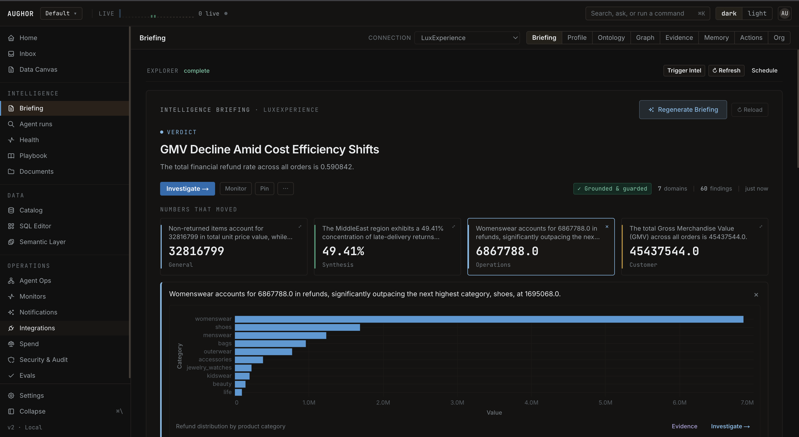

<div align="center">
  
  <h1>Aughor</h1>
  <p><strong>The autonomous intelligence platform for your data warehouse.</strong></p>
  <p><em>Your warehouse, always thinking.</em></p>

  <p>
    <a href="https://github.com/sidhasadhak/aughor/actions/workflows/ci.yml"></a>
    <a href="LICENSE"></a>
    
    
  </p>

  <p>
    <a href="#quick-start"><strong>Quick start</strong></a> ·
    <a href="#pick-your-models"><strong>Models</strong></a> ·
    <a href="#whats-inside"><strong>What's inside</strong></a> ·
    <a href="ROADMAP.md"><strong>Roadmap</strong></a> ·
    <a href="FEATURES.md"><strong>Features</strong></a>
  </p>

  
</div>

---

Aughor connects to your warehouse and **keeps learning from it**. It builds a living map of your business — entities, relationships, governed metrics, lifecycles — explores the data on its own, and answers hard analytical questions in plain English with **evidence, citations, and computed confidence**.

> **The thesis:** most AI data tools are query wrappers — you ask, they translate. Aughor explores your data in the background, forms a business ontology, and is engineered so the numbers it reports are **trustworthy, not just plausible**: deterministic guards sit between the model and every figure you see.

- 🔭 **It explores on its own.** Connect a warehouse and it starts learning — no prompts — keeping a frontier of what it has already covered and re-exploring as schema and data move (governed per connection).
- 🧠 **It builds an ontology, not a dashboard.** Entities, relationships, metrics, and lifecycles inferred from real data, human-editable with override-wins semantics, version-controllable.
- 🏭 **It adapts to your industry.** An airline gets load-factor and on-time performance; a retailer gets AOV and return-rate — from a per-industry metric knowledge base, not one generic lens.
- 🛡 **It refuses to be confidently wrong.** Engine-driven trust guards (grain, fan-out, numeral grounding, premise validation, adversarial refutation) run on every answer.
- 🕰 **It discovers *when* matters.** You never pick a date range; the window anchors to the data's own activity.
- 🔌 **It runs fully local.** Your warehouse, your models — nothing has to leave your machine.

## Quick start

**You need:** [uv](https://docs.astral.sh/uv/), **Python 3.11+**, and **Node 20.9+**.

```bash
git clone https://github.com/sidhasadhak/aughor.git && cd aughor
uv sync --all-extras   # Python deps (DuckDB is built in)
uv run aughor up       # installs web deps on first run; API :8000 + web :3000
```

Open **http://localhost:3000**. Aughor starts empty — no data is created on your behalf. Click **+ Add** and paste a DuckDB path, a PostgreSQL DSN, or BigQuery credentials, and exploration begins. Want something to explore first? `uv run aughor seed` writes a synthetic demo dataset with a discoverable outage.

`aughor up` never kills an existing process — a busy port names its owner and exits (`--api-port` / `--web-port` to move; `--dev` for auto-reload; `--api-only` / `--web-only` to split). Or run the pieces yourself:

```bash
uv run uvicorn aughor.api:app --port 8000    # API
cd web && npm install && npm run dev          # web UI on :3000 (NEXT_PUBLIC_API_URL if API moved)
```

A bare `uv sync` installs the **serving core** only; heavyweight features ship as [extras](#optional-extras) and degrade with a message naming what to install — nothing crashes.

## Pick your models

Aughor **ships no default model** — nothing is assumed about another vendor's catalogue, so you name one before your first question. The one route to a model is **Settings → Models** in the web UI: pick a backend, and the picker lists what that backend actually serves (plus your custom entries). Backends: **Ollama · LM Studio · Groq · Together · Anthropic · Gemini · OpenRouter** (OpenRouter and Gemini both have free tiers).

- **Three roles, independently pluggable:** SQL generation (`coder`), report synthesis (`narrator`), and the fast interpret sub-tier (`fast`) each resolve on their own — run a fast structured model for SQL and a stronger one for prose.
- **A fallback you choose and watch:** pick a fallback backend/model in Settings; when the primary fails, the chain fails over — and since the run narrates its hops in the chat stream, a failing primary can't hide behind a healthy fallback. Pin the chain order with `AUGHOR_FALLBACK_BACKENDS` when you need to.
- **Env is the fallback layer**, not the primary config: `cp .env.example .env` and set `AUGHOR_BACKEND` + a key for headless/deployment setups; Settings wins when both exist.
- The `aughor up` boot summary shows whether a backend and model are configured (no network call — it can't tell you the backend is *reachable*). The API serves without an LLM; questions fail until one answers.

Minimal fully-local `.env`:

```env
AUGHOR_BACKEND=ollama
AUGHOR_CODER_MODEL=qwen2.5-coder:14b
AUGHOR_NARRATOR_MODEL=qwen2.5-coder:14b
OLLAMA_BASE_URL=http://localhost:11434/v1
AUGHOR_EMBED_MODEL=nomic-embed-text
```

## What's inside

One corpus of intelligence behind many surfaces — the depth, mechanisms, and trade-offs live in **[FEATURES.md](FEATURES.md)**.

**Intelligence**
- **Briefing** — conclusion-first and impact-ranked: a verdict, the numbers that moved, grounded charts, live industry KPIs. Interrogable (Explain / Drill / Ask; click a number to re-run its query) and gated on the governed metric layer before anything can headline.
- **Chat** — **Agent mode is the default**: a deep, multi-phase run with a plan you can edit, streamed progress, and interrupt-anytime input. Quick mode for a straight answer. Deep runs execute as supervised jobs that survive a closed tab; reload-and-reattach ships behind the `ask.resume_stream` flag, and every conversation — quick and deep turns alike — restores from history.
- **Deep analysis** — intake → baseline → decompose → dimensional → synthesize, with premise validation, period-over-period decomposition anchored to the data's real window, loss-intent and multi-lens scans, and a report that is honest by construction (one canonical grain, consistent units, charts that match their prose).
- **Autonomous exploration** — phase-structured, frontier-incremental, grounded in the actual schema by construction; findings prove themselves with confirming queries and land in the Evidence Ledger.
- **Ontology & semantic layer** — auto-built, human-editable, compiled into docs; governed metrics resolve through one precedence-ranked contract that chat, deep analysis, and the explorer all read.
- **Trust guards** — the layer that separates Aughor from a plausible demo: grain/fan-out/numeral/premise/refutation guards, one shared SQL-safety pipeline across every mode, earned-confidence computed (never asserted), snapshot-pinned receipts.
- **Adaptive temporal scope** — four tiers from activity-anchored recency to a cost governor for TB-scale warehouses.

**Data**
- **Connectors** — DuckDB · PostgreSQL · **BigQuery** (run live in production against a real warehouse) · Snowflake · MySQL · local upload (CSV/Parquet/Excel) · S3 · Google Sheets · Stripe / HubSpot / Salesforce · Confluence / Notion. Credentials Fernet-encrypted at rest; a per-dialect capability contract keeps generated SQL runnable on each engine.
- **SQL Editor & Data Canvas** — a first-class SQL surface with results, charts, and open-in-editor from any answer; a canvas for composing analyses.
- **Catalog & Semantic Layer** — browsable schema intelligence, glossary, metric governance.

**Operations**
- **Agents & Agent Ops** — user-defined analyst personas with scoped bindings, run history, and a control room; approvals are risk-graded and audited.
- **Monitors & notifications** — findings become monitors; alerts deliver to Slack/webhook on guarded evaluations.
- **Evals** — NL2SQL validated against TPC-H / TPC-DS / ClickBench / a golden set, running the full pipeline (the number reflects the product, not a harness).
- **MCP server** — Aughor's governed answers as [MCP](https://modelcontextprotocol.io) tools (`python -m aughor.mcp`): Claude Desktop / Claude Code / Cursor get a verified answer with a Trust Receipt, not raw SQL.
- **Agent skill & catalog** — [`SKILL.md`](SKILL.md) teaches a coding agent the governed workflow; [`llms.txt`](llms.txt) and a machine-readable connector catalog ([`aughor/connectors/catalog.json`](aughor/connectors/catalog.json), secrets flagged) make the platform legible to tools.
- **Security & RBAC** — fail-closed SQL safety gate, read-only Postgres, SSRF allowlist, prompt-injection fencing; flag-gated org tenancy with a viewer ⊂ analyst ⊂ owner ladder and row-level policy compiled into every connector's WHERE.

## Stack

| Layer | Technology |
|---|---|
| Backend | Python 3.11+, FastAPI, LangGraph |
| Frontend | Next.js 16 (App Router, Turbopack), TypeScript, Tailwind |
| Analytics | DuckDB, PostgreSQL, BigQuery |
| Charts | Vega-Lite — one grammar for screen and PDF/PPTX export |
| LLM runtime | Ollama · LM Studio · Groq · Together · Anthropic · Gemini · OpenRouter, per-role, with a chosen fallback chain |
| Statistics · SQL | scipy, numpy · SQLGlot |
| Observability | OpenTelemetry (GenAI semantic conventions) — point `AUGHOR_OTLP_ENDPOINT` at Jaeger/Tempo/Langfuse; unset = no export |
| State · Packaging | SQLite (history, registry, evidence, audit) · uv |

## Project structure

```
aughor/
├── aughor/
│   ├── agent/        # LangGraph investigative loop + phase prompts
│   ├── connectors/   # DuckDB, Postgres, BigQuery, Snowflake, Stripe, …
│   ├── evidence/     # Evidence ledger — claims, confidence, feedback
│   ├── explorer/     # Background exploration, grounding, cost/watermark
│   ├── kernel/       # Jobs, ledger, flags, metering — the supervision spine
│   ├── ontology/     # Ontology builder, enricher, validator, store
│   ├── routers/      # FastAPI domain routers (async, SSE)
│   ├── semantic/     # Glossary, metrics, compiler, canonical resolver
│   ├── sql/          # SqlWriter, shared safety pipeline, guards
│   └── tools/        # schema-linker, data catalog, profiler, stats
├── evals/            # TPC-H / TPC-DS / ClickBench / golden / real-DB harnesses
├── web/              # Next.js app — components, lib, design tokens
├── docs/             # architecture, roadmaps, audits
└── tests/            # pytest suite — hermetic, offline, failure-path + chaos
```

## Configuration

`.env` at the repository root; [`.env.example`](.env.example) is the full reference. Essentials:

| Variable | Default | What it does |
|---|---|---|
| `AUGHOR_BACKEND` | `ollama` | `ollama` \| `lmstudio` \| `groq` \| `together` \| `anthropic` \| `gemini` \| `openrouter` |
| `AUGHOR_CODER_MODEL` / `AUGHOR_NARRATOR_MODEL` | — | Per-role models (Settings → Models overrides env) |
| `AUGHOR_FALLBACK_BACKENDS` | Settings choice | Pin the failover chain order (`none` disables it) |
| `AUGHOR_DEFAULT_POSTGRES_DSN` | — | Pre-loads a Postgres connection on startup |
| `AUGHOR_QDRANT_URL` | `http://localhost:6333` | Vector store for semantic search (`semantic` extra) |

**Before exposing Aughor beyond `localhost`,** read [SECURITY.md](SECURITY.md) — the defaults assume a trusted single-user machine (`AUGHOR_API_KEY` gates requests when set; `AUGHOR_CORS_ORIGINS` scopes browsers; `AUGHOR_SECRET_KEY` encrypts stored credentials).

### Optional extras

```bash
uv sync --all-extras                      # everything (recommended for development)
uv sync --extra export --extra semantic   # or pick individually
uv sync                                   # serving core only
```

| Extra | Adds | Without it |
|---|---|---|
| `export` | PDF / PowerPoint reports | Export answers **501**, naming the extra |
| `semantic` | Semantic search over past analyses | Reads return no hits, writes no-op (also needs Qdrant) |
| `fastread` | Faster bulk table reads (polars) | Falls back to DuckDB automatically |
| `warehouse` | Snowflake, BigQuery, MySQL | Those connectors are unavailable |
| `crm`, `cloud-storage`, `knowledge-sync` | Stripe/HubSpot/Salesforce, Azure Blob, Confluence/Notion | Those connectors are unavailable |
| `observability`, `evals` | OTel/Langfuse export, eval harnesses | Tracing and harnesses unavailable |

Every extra degrades with a message naming the install command, and a footprint test keeps heavy packages off the API's import path. Sizes drift with platform — measure rather than trust: `uv run python scripts/measure_footprint.py --compare`.

## Project status

**Alpha.** No tagged release; `main` is the only supported branch.

What is real today: **8,000+ backend tests**, green on Python 3.11–3.13, hermetic and offline; `ruff` at a zero baseline; CI additionally gates codegen drift for the typed API client. The frontend typechecks under `strict`, carries **300+ vitest tests** (pure-logic and jsdom component projects), and runs six focused lint gates. What is not: `eslint` reports pre-existing findings and is not a CI gate; there is no container image (the only Docker asset composes Qdrant); deployment beyond a local machine and a Vercel data plane is young.

## Roadmap, contributing, security

- **[ROADMAP.md](ROADMAP.md)** — prioritized backlog and shipped milestones · **[FEATURES.md](FEATURES.md)** — the living reference (160+ features, mechanisms, and files) · **[docs/PLATFORM_ARCHITECTURE.md](docs/PLATFORM_ARCHITECTURE.md)** — tenancy, catalog, and the control/data-plane split.
- Contributions welcome — start with **[CONTRIBUTING.md](CONTRIBUTING.md)**; the load-bearing conventions (default-off flags, guards that ship with a test proving they fire, never raising a ratchet baseline) are documented there. [Code of Conduct](CODE_OF_CONDUCT.md) applies.
- Report vulnerabilities **privately** — see [SECURITY.md](SECURITY.md).

## Acknowledgements

[LangGraph](https://github.com/langchain-ai/langgraph) · [DuckDB](https://duckdb.org) · [SQLGlot](https://github.com/tobymao/sqlglot) · [FastAPI](https://fastapi.tiangolo.com) · [Next.js](https://nextjs.org) · [Vega-Lite](https://vega.github.io/vega-lite/) · [DM Sans](https://github.com/googlefonts/dm-fonts) (SIL OFL 1.1). The human-command surface is shaped by Palantir Foundry's AI FDE ideas; the trust-and-verification framing owes a debt to MotherDuck's writing on governed semantic layers.

## License

[Apache License 2.0](LICENSE). Redistributed third-party assets (the DM Sans font files) carry their own licenses — see [NOTICE](NOTICE).
