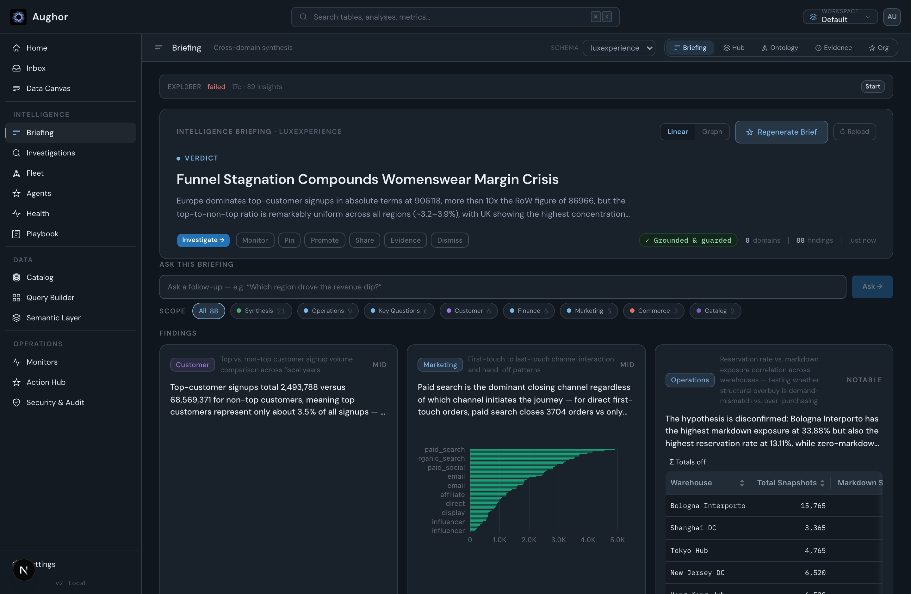
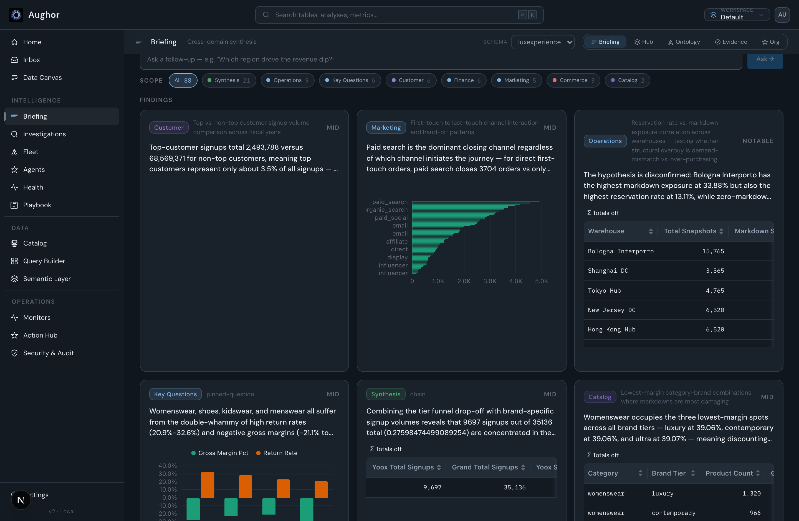
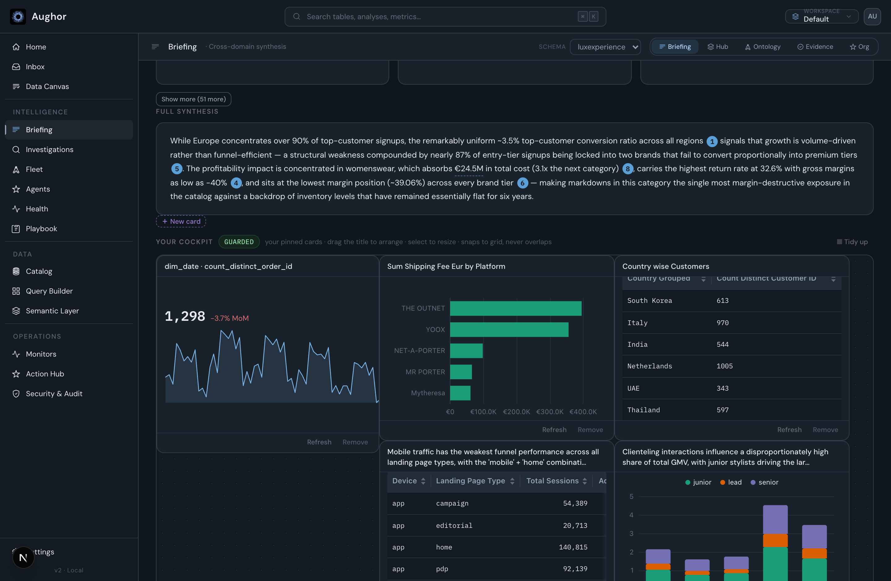
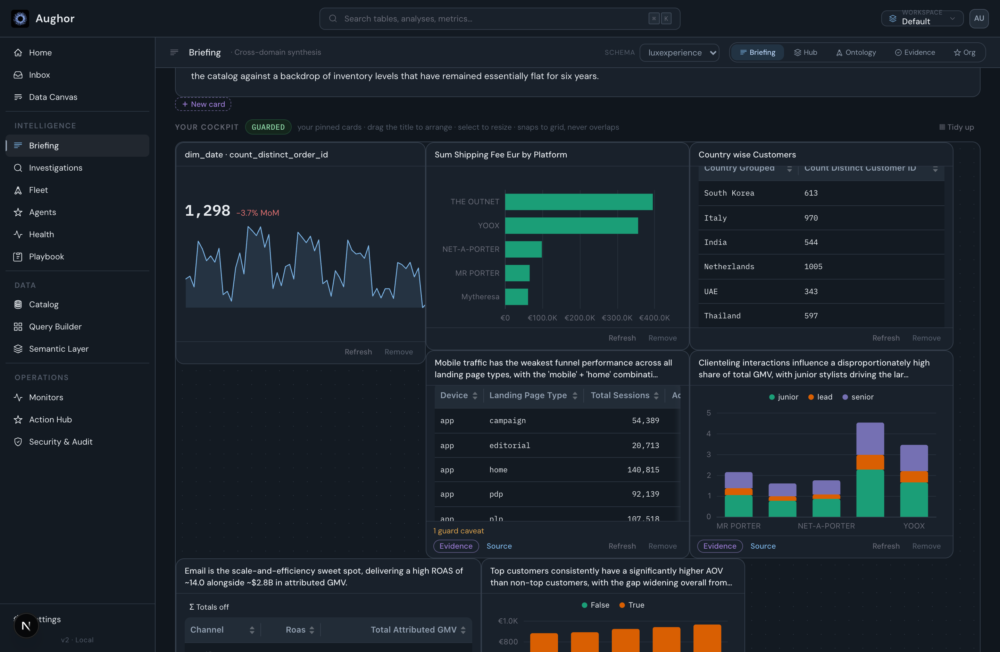

# Briefing Tab — Design Handoff

**For: a design-focused pass on the Briefing tab. From: the eng thread that just restructured it.
Date: 2026-07-19. Status: describes the current working tree (some of it uncommitted — see §9).**

This is a working brief, not a spec to implement literally. It gives you (a) what the Briefing is
*for*, (b) the exact design system you must stay inside, (c) an honest map of what's on the page
today, and (d) the real open questions where the page needs a designer's judgment. Prescribe
layouts/hierarchy freely; don't invent a new visual language — extend the one in §3.

---

## 0. TL;DR

The Briefing is Aughor's answer to "how is the business doing, and what changed this cycle?" It's a
**self-explaining dashboard**: an AI-authored verdict on top, the findings that support it (each with
its own grounded chart), and a user-curated cockpit of pinned KPIs. The north star: *every number is
one click from the finding that explains it, and every number is real (grounded + trust-guarded).*

The page works but reads dense. The last redesign (findings → uniform "exhibit strip", cockpit back to
pins-only) fixed the worst of it; the open work is **hierarchy, density, and the verdict→evidence
reading flow** across a long page. See §6.

---

## 1. What the Briefing is (product thesis)

Leadership wants two things a plain dashboard and a plain narrative each half-serve: **grip over time**
(trends/scorecard) and **the narrative** (what changed this cycle and why). A BI dashboard gives dead
numbers with no explanation; a narrative gives explanation with no standing scorecard. Aughor's edge —
**grounded, trust-guarded, *explained* numbers** — lets it do the thing neither does.

So the Briefing carries **two layers on one surface**:

- **Narrative layer** (this cycle): the explorer's verdict + findings + the full synthesis. Curated,
  cycle-specific. "What changed and why."
- **Standing layer** (the cockpit): the user's own pinned KPI/chart cards that persist and refresh.
  "Grip over time." The user curates this — it is *theirs*.

They are meant to be wired together (a pinned KPI links to the finding explaining its move). Every
finding and every pinned number is grounded in real SQL and cleared by a battery of trust guards
before it renders — that guarantee ("Grounded & guarded") is the product, and it constrains design:
**we never show a number we can't back, and mockups must not fake data** (§7).

**Non-goal:** rebuilding a BI tool. The moment a card is a dumb tile with no link to *why*, we've built
a worse Looker. The explanation is the product.

---

## 2. See it live

The app is dark-only, desktop-first. To view the Briefing with real data:

- Backend: `.claude/launch.json` → `aughor-api` (FastAPI on `:8000`).
- Frontend: `aughor-web` (Next 16 / Turbopack on `:3000`). App boots straight into **Briefing** on the
  `workspace` connection, `luxexperience` schema (a luxury-fashion e-commerce dataset — funnel,
  margins, returns, channels). ~8 domains · ~88 findings, so it's a realistic worst-case for density.
- **Chart-lab** (`/chart-lab`, no backend needed): every chart type + the KPI stat-tile, on fixed
  sample data. The fastest way to eyeball the chart/tile vocabulary in isolation.

Run instructions and gotchas live in `memory/briefing-cockpit.md` (the eng log). The whole initiative's
design rationale is in `docs/BRIEFING_COCKPIT_2026-07-18.md`.

### Current-state screenshots

Captured 2026-07-19 from the live `:3000` app on the `luxexperience` data, at 1440px wide (retina).
These are the *current* working-tree state (§9), including the uncommitted restructure. The app chrome
(left nav + top bar) is shown for context — the Briefing is the main pane.

**The linear brief, top:** explorer bar → verdict hero → ask box → scope chips → findings strip.
Note the calm, flat treatment and how similar in weight each band is (the hierarchy question, §6.1).

**Findings exhibit strip:** uniform cards — domain eyebrow + novelty · finding statement (clamped) ·
its own grounded chart/table (or a big scalar; errors degrade to text-only) · hover-revealed
Evidence/Investigate. Impact-ordered; "Show more" walks the full set.

**Full synthesis:** the AI narrative with inline citation chips `[1][2]` that drill to the cited finding.

**The cockpit (standing layer):** a pins-only React-Flow canvas of the user's own guard-checked
KPI/chart/table cards — drag-by-title, resize, snap-to-grid, persisted. "＋ New card" composes a new one.

> **Removed 2026-07-21:** the briefing also carried a **Graph lens** (the brief as a node-and-edge
> argument graph). It was cut — it did not help readers, and one linear reading order is the point.
> The brief now has a single presentation.

---

## 3. The design language — **stay inside this**

The Briefing was recently unified onto the shared **Deep-Analysis / Insight** system. It is mature and
opinionated. Design work should compose these primitives, not fork them.

### 3.1 Principles (already in force)

- **Flat, not chrome.** Cards are `background: var(--bg-2)` + `1px solid var(--b1)` + `var(--r3)` radius.
  No gradients, glows, or drop shadows for emphasis. Prominence comes from **position, size, and the
  primary action** — not decoration. (The verdict hero used to be a glowing gradient; it was
  deliberately flattened.)
- **Dots, not boxes.** Status/novelty reads as a small dot + label or a thin meter, not a loud colored
  pill. Color is used sparingly and semantically (green = good/guarded, red = bad, amber = caution,
  violet = user/pinned, blue = primary/AI).
- **11px is the floor.** No UI text below 11px, ever. There's a gate that enforces it for Tailwind
  sizes; honor it for inline styles too.
- **Two fonts only.** DM Sans (UI, `var(--font-sans)`) and IBM Plex Mono (`var(--font-mono)`) for
  **figures, ids, timestamps, metrics** — anything numeric/tabular is mono + `tabular-nums`.
- **Semantic color families come in 1–5 ramps** (`--blue1`…`--blue5`, etc.): 1 = faint bg tint, 2 =
  border, 3–4 = fill/text, 5 = strong text. Use the ramp, don't hand-pick hexes.

### 3.2 Tokens (`web/styles/tokens.css`)

- **Surfaces:** `--bg-0` (app) → `--bg-1` → `--bg-2` (cards) → `--bg-3` (raised/hover) → `--bg-4`.
- **Text:** `--t1` (primary) → `--t2` → `--t3` → `--t4` (faintest/meta).
- **Borders:** `--b0`…`--b3` (b1 = default hairline, b2/b3 = hover/emphasis).
- **Semantic ramps:** `--blue{1-5}` (primary/AI), `--grn{1-5}` (good/guarded), `--amb{1-5}` (caution),
  `--red{1-5}` (bad), `--vio{1-5}` (user/pinned/selection), `--cyn{1-5}`.
- **Chart categorical:** `--chart-1`…`--chart-6` (series/accents; the KPI tiles cycle these).
- **Radius:** `--r1` (tight) · `--r2` · `--r3` (cards) · `--r-pill`.
- **Motion:** `--dur-fast` (the standard micro-transition). Motion is subtle — hover lifts, opacity
  reveals, a NumberFlow odometer on KPI values. No decorative animation.

### 3.3 Type scale (`web/styles/type.css`)

Size-only utilities (set font-size, nothing else) so you can size without changing color/weight:
`aug-fs-xs` 11 · `aug-fs-sm` 12 · `aug-fs-ui` 13 (base) · `aug-fs-h2` 15 · `aug-fs-h1` 18 ·
`aug-fs-display` 22 (hero verdict + big KPI figures). Full-semantic variants (`aug-text-*`) also set
color/weight/line-height.

**`aug-label`** = the canonical section eyebrow: 11px / 600 / uppercase / `.1em` tracking / `--t3`.
Every section header on the page is one of these ("Findings", "Full synthesis", "Your cockpit", "Key
Metrics", "Top Patterns", "Scope", "Ask this briefing").

### 3.4 Components (`web/app/globals.css` + `web/components/`)

- **`.aug-tag`** + `.aug-tag-{blue,green,amber,red,violet,gray,cyan}` — small mono pill (e.g. "✓ Grounded
  & guarded" in green).
- **`.aug-panel`** — the flat card shell (bg-2 / b1 / r3).
- **`.aug-input`** — the text field.
- **`<Button>`** (base-ui, `web/components/ui/button.tsx`) — the single canonical button. Variants:
  `default` (blue solid, primary), `secondary` (hairline), `ghost` (translucent), `minimal` (outlined),
  `outline`, `destructive`, `link`. Sizes `xs/sm/default/lg` + icon sizes. **Do not hand-roll buttons.**
- **`DomainTag`** — a colored-tint pill for a finding's domain (Customer, Finance, Marketing…). Color is
  hashed from the domain name (`domainColor`).
- **`StatTile`** (`web/components/brief/StatTile.tsx`) — the **one canonical KPI tile**: accent · label ·
  big mono value · favorability-aware delta badge (a rising CAC is *red* though it's "up") · sparkline ·
  caption · optional expand. Used by the Key-Metrics strip; reuse it for any metric-at-a-glance.
- **`ResultChartCard`** / `Chart` — the chart engine (ECharts). Renders chart/table/pivot with a hover
  pencil that opens a right-docked viz editor. This is how every chart on the page draws.

---

## 4. Current anatomy (top → bottom, as it renders today)

The page is a single scrolling column, `padding: 20px 28px`. In reading order:

| # | Section | Role | Current treatment | Owner |
|---|---|---|---|---|
| 1 | **Explorer control bar** | Run/refresh the AI explorer; shows its phase | Thin flat strip, mono "EXPLORER" label + status + Start/Refresh | `BriefingPanel.tsx` |
| 2 | **Verdict hero** | The ONE conclusion, up front | Flat panel: "Verdict" dot+label, `aug-fs-display` headline, one-line proof, primary **Investigate →** + finding actions, right-side "✓ Grounded & guarded" tag + provenance stat pills (N domains · N findings · freshness). Also holds Generate/Reload. | `VerdictHero` |
| 3 | **Ask this briefing** | Follow-up Q&A anchored to the brief | `aug-input` + "Ask →"; answers stack as inline investigation cards | `BriefAskBox.tsx` |
| 4 | **Scope chips** | Filter the narrative layer by domain | Pill row: "All N" + per-domain chips (color dot + count). Active = blue. | `ScopeChips` |
| 5 | **Findings (exhibit strip)** | The narrative layer's reading surface | Responsive grid (`minmax(300px,1fr)`) of **uniform** cards: domain eyebrow + novelty · finding statement (clamped 3 lines) · **its own grounded chart** (or a big scalar figure; errors degrade to text-only) · hover-revealed **Evidence / Investigate →**. Starts at 6, **"Show more" +12**. | `SupportingSignals` / `ExhibitCard` |
| 6 | **Full synthesis** | The multi-paragraph AI narrative | Flat card, `aug-fs-ui` prose with inline citation chips `[1][2]` that drill to the cited finding. | `NarrativeCard` |
| 7 | **Your cockpit** | Standing layer: user's pinned KPI/chart cards | "＋ New card" composer + a **React-Flow canvas**: drag-by-title, resize, snap-to-grid, no-overlap, server-persisted layout. Each card = value/chart/table + Source/Set-alert/Refresh/Remove. "Guarded" tag + "▦ Tidy up". Renders nothing if the user has no pins. | `PinnedCards.tsx` / `PinnedCardsCanvas.tsx` |
| 8 | **Key Metrics** | The vertical's north-star KPIs | Row of `StatTile`s (label · odometer value · delta · sparkline), click to expand a trend chart. **Often empty** (this workspace has no north-star metrics defined → the section renders nothing). | `IndustryKpiStrip.tsx` |
| 9 | **Top Patterns** | Cross-domain structural patterns | Compact clickable rows (icon · title · "N domains · N findings" · type + hover chevron). Linear lens only. | `PatternRow` |

**Empty / loading states exist and are designed:** content-shaped skeleton shimmer while loading; a
diagnostic empty state ("no exploration has run → Start" vs "running…" vs "failed → Restart"). Toasts
(bottom) confirm side-effects (pin, remove, refresh, alert) or surface a guard refusal.

---

## 5. One reading order

The brief has a **single** presentation: the exhibit strip → full synthesis → patterns, in that order.

There used to be a second **Graph** lens (the same brief as a node/edge argument graph, behind a
`Linear | Graph` toggle in the verdict hero). It was **removed 2026-07-21**: it did not help readers
reach the conclusion faster, and a brief that argues one thing should have one reading order. Design
work here should go into making the linear brief scan better, not into an alternate view of it.

---

## 6. Where we need your eye (the design questions)

Ranked by impact. These are briefs, not solved.

1. **Page hierarchy & reading flow (top priority).** The page is long and every section competes at
   similar weight. The intended arc is **verdict → its evidence → the standing scorecard → depth**, but
   a reader scrolling doesn't feel that gradient. Questions: How should weight step down from the hero?
   Should "Findings" and "Full synthesis" be one thing (the evidence for the verdict) rather than two
   stacked sections? Does the ask box belong that high? We removed a sticky section-nav rail (it felt
   bolted-on); if navigation of a long brief matters, what's the in-system way to do it?

2. **The findings exhibit strip — density & legibility.** This is the core reading surface and the
   thing the user explicitly called "hard to read" before. Each card is now uniform (statement +
   chart). Questions: Is a chart-per-card right, or is it too much viz at once — should some findings be
   statement-only with the chart on demand? Is the fixed chart height (190px) legible for the chart
   *types* that show up (bars, combos, small tables)? Card min-width is 300px → 3–4 up on desktop; is
   that the right density vs. a 2-up "more room to breathe" layout? How should the **"Show more"** feel
   past the first 6 (it can walk ~50+ findings)?

3. **Verdict hero.** It's the most important element and currently a calm flat panel. Is it prominent
   *enough*? The proof line, the "Grounded & guarded" trust badge, and the provenance stat pills all
   live in the hero — is that the right density, or is the trust guarantee under- (or over-) sold? How
   should the headline scale on very long verdict text?

4. **The cockpit (standing layer).** It's a React-Flow canvas the user arranges (drag/resize/snap).
   Real questions: does a freeform canvas *earn* its complexity for a scorecard, or would a simpler
   responsive grid read better and still feel "yours"? What's the **empty state** (no pins yet) — right
   now the whole section just doesn't render, so a first-time user never learns the cockpit exists. How
   do we make the standing layer feel distinct from the narrative layer above it?

5. **Scope chips.** Useful, but they expose *every* domain including two meta-domains ("Key Questions",
   "Synthesis") that aren't real business areas. Should those be styled/grouped differently, or
   demoted? Is a pill row the right filter affordance at 8+ domains?

6. **Key Metrics often empty.** Many connections have no north-star metrics, so the section vanishes.
   Design question: should there be a designed empty/CTA state ("define your north-star KPIs"), or is
   silent-omission correct?

7. **Responsive.** Desktop-first today; there's a known tablet squeeze (3-up grids get tight). Define
   the breakpoints and the graceful degradation — this hasn't had a real pass.

---

## 7. Hard constraints (non-negotiable)

- **Dark-only.** There is no light theme. Design for dark; don't spend effort on a light variant.
- **Self-hosted, Apache-2.0, no external calls.** No CDN fonts, no third-party embeds. Fonts are the
  two bundled families (§3.1). Anything you introduce must be local/inlineable.
- **Real data only — the trust plane is the product.** Every finding and pinned number is grounded in
  SQL and cleared by trust guards before render; a bad/mis-grained query is *refused*, not shown.
  Mockups and prototypes must use realistic real-shaped data (use `/chart-lab`'s fixtures or the live
  `luxexperience` set) — **never lorem-ipsum numbers or fake charts**, because "you can trust every
  number" is the thing being sold.
- **Tech reality:** React 19 / Next 16 (Turbopack), **ECharts** for all charts, **React Flow**
  (`@xyflow/react`) for the cockpit. Charts and the cockpit are heavy client
  components. Per-card chart fetches happen lazily — design shouldn't ask for 50 charts on screen at
  once.
- **The `.aug-*` system + `<Button>` are canonical.** New raw `<button>`s are ratcheted against; new
  hardcoded radii / sub-11px sizes are gated. Stay in the tokens.

---

## 8. What a good outcome looks like

Not a reskin — the visual language is settled. A good outcome is **hierarchy and flow**: a reader lands
on the verdict, understands it, and can follow it down into its evidence and out to the standing
scorecard without the page feeling like a wall. Concretely, wins would be: a clear weight gradient from
hero → evidence → cockpit; a findings surface that's scannable at a glance and legible on demand; a
cockpit whose empty and populated states both feel intentional; and a resolved answer to "one long
column vs. structured regions." Keep the two-layer thesis legible: the narrative (what changed) and the
standing scorecard (grip over time) should read as distinct but wired.

---

## 9. Honest current state (so you're not surprised)

The Briefing was **just restructured** and part of that is **uncommitted** in the working tree (live on
`:3000`, but PR #178 doesn't have all of it yet). What you'll see running it *now* is the intended
current state; the git history lags. Specifically:

- **Committed (PR #178):** scope chips, the StatTile primitive, hover-row reveals.
- **Uncommitted on top (current working tree):** a sticky "On this brief" nav rail was *added then
  removed* (felt bolted-on); a scope-chip dedup fix; and the big one — **findings moved out of the
  cockpit into the uniform "exhibit strip"**, cockpit reverted to pins-only. §4 describes the
  *post*-change state.
- **Known rough edges:** the KPI strip is empty on this dataset (§6.6); the cockpit has no empty-state
  (§6.4); tablet responsive is unfinished (§6.8); `web/components/brief/BriefingDashboard.tsx` is dead
  code (an old findings grid, no call sites) — ignore it.

---

## 10. File map (where things live)

- **Spine:** `web/components/BriefingPanel.tsx` (the whole page + verdict hero + scope chips + exhibit
  strip + narrative + patterns).
- **Cockpit:** `web/components/brief/PinnedCards.tsx` (container) + `PinnedCardsCanvas.tsx` (the RF
  canvas) + `NewCardComposer.tsx` (authoring) + `gridLayout.ts` (packing).
- **KPI / stat tile:** `web/components/brief/IndustryKpiStrip.tsx` + `StatTile.tsx`.
- **Shared brief primitives:** `web/components/brief/{Brief,BriefProse,GroundedNumber,Sparkline,
  StatusChip}.tsx`.
- **Charts:** `web/components/charts/ResultChartCard.tsx` + `web/components/Chart.tsx` + `charts/echarts/`.
- **Design system:** `web/styles/tokens.css` (color/space/motion), `web/styles/type.css` (type scale),
  `web/app/globals.css` (`.aug-*` classes), `web/components/ui/button.tsx`.
- **Live playground:** `web/app/chart-lab/page.tsx`.
- **Product rationale:** `docs/BRIEFING_COCKPIT_2026-07-18.md`; eng log: `memory/briefing-cockpit.md`.
