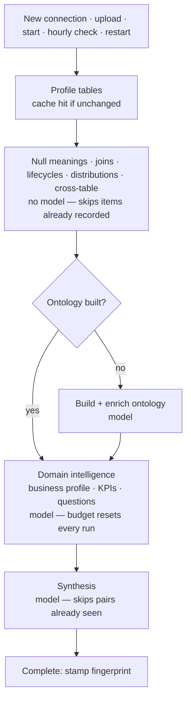
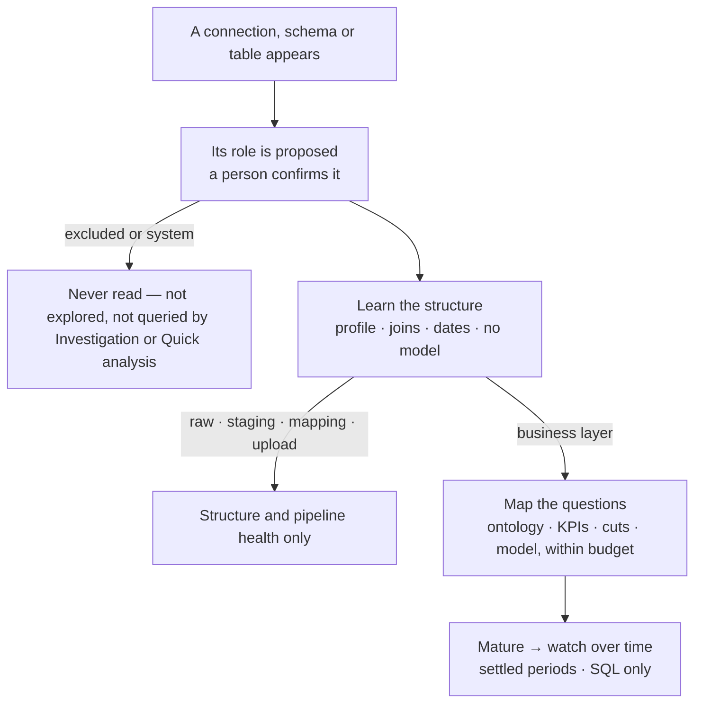
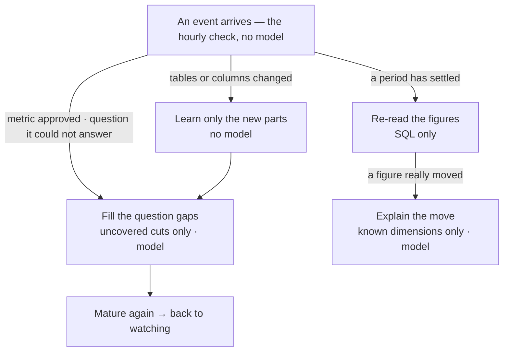

# Exploration principles — what the Explorer explores, when, and when it is done

*Study, 2026-10-07. Asked by the user after the hourly check was found to have re-armed nothing since
2026-09-26: "How would the Explorer know which data set to explore and when? Should it be every hour,
24 hours, 365 days? And when does it realise that all the angles are now covered and it's only the time
period as the only new factor?" The principles below were proposed in chat and amended by the user the
same day; the decisions in §9 are theirs. §8's honest status for stuck runs was built the same day; the rest
— §11's five parts — was built on 2026-10-08, and §12 says what each part is and what is not built.*

## 1 · What is true today (measured 2026-10-07)

- **The check.** `explorer/continuous.py` wakes hourly (the first check an hour after the API starts, so a
  restart resets it). It re-arms a connection only when the schema fingerprint changed, the last COMPLETE
  run is older than 7 days (`AUGHOR_EXPLORER_REFRESH_DAYS`), or a run its own budget stopped is a day old.
  The hourly part is the check; the work was meant to be about weekly.
- **Nothing ran after 2026-09-26** because every connection sat in a state the check never touches:
  theLook, DuckDB and spotify stuck mid-run (an API restart killed the run; the phase still reads as running);
  six of the Workspace's eight datasets "failed" and failures are never retried, while the check read only
  the first dataset; three runs ended "cancelled (budget exceeded or stopped)", wording that cannot tell a
  budget stop from a person's, so they are treated as a person's.
- **Coverage is measured per question already.** `explorer/frontier.py` tracks coverage per measure ×
  dimension cut; `explorer/coverage_manifest.py` enumerates the questions the data supports — with time
  axes that unlock at 4 periods (trend), 12 (seasonality) and 24 (year on year).
- **A finding can already be re-read for a new range with SQL alone** (`briefing/reask.py`), no model.
- **A second run is not shorter.** There is no incremental path: a re-run walks every phase again. The
  model-free phases skip items already recorded (a join, a null meaning, a lifecycle) but re-query every
  item that found nothing; the domain phase — the one that spends — resets its per-domain budget in the
  question-list mode (`explorer/agent.py`, `used = 0 if self._manifest_driven`), so its model loop runs in
  full every time, steered away from repeats only by the prompt. The question list's own reuse needs the
  schema fingerprint, which is stamped only at COMPLETE, so it starts working on the third run, not the second.
- **Excluding a table today excludes nothing.** `ontology/visibility.py` records exclusions, and only the
  coverage denominator reads them; exploration, Investigation and Quick analysis all still query the table.
- **Nothing knows what a dataset is for.** Staging, raw, mapping and uploaded tables are explored like the
  business layer. The only related rule is a prompt line that strips "Stg", "Fact" and "Dim" from names.

## 2 · Principle 1 — three jobs, three triggers

The Explorer does three jobs, and each has its own trigger. None of them is a fixed clock.

| Job | What | Runs when | Finishes? |
|---|---|---|---|
| **Learn the structure** | joins, grain, dates, what an empty value means, lifecycles | the schema fingerprint changes (a cheap check, no model) | yes — once per schema version |
| **Map the questions** | measure × dimension cuts, cross-table questions | while coverage is incomplete — at most daily per dataset | yes — when the dataset is mature (§3) |
| **Watch over time** | what moved, trends, seasonality, anomalies | a period has arrived **and settled**, at each metric's date grain | never — but it is SQL re-reads, cheap |

The hourly heartbeat stays as a no-model check. Spend happens on events: the schema changed, data arrived
and settled, a metric was approved, coverage has a gap, a person asked something it could not ground.

## 3 · Principle 2 — maturity, per schema and per table, shown

Every schema and every table carries a **maturity** reading the person can see — three levels, each a
percentage, drawn as three short vertical bars with the number beside them, in the Catalog and the scope bar:

| Bar | Means | 100% when |
|---|---|---|
| **Structure** | the platform knows its shape | every table profiled, joins verified, dates and empty values read |
| **Questions** | the question space is explored | the coverage manifest's material cells are covered, or the last two runs found almost nothing new |
| **Time** | it is being watched | its metrics have dates and the newest settled period has been read |

A schema's maturity is its tables', weighted by role (§5): a staging schema's Questions bar is not expected
to fill, and says "not explored — staging" instead of reading as 0%.

**Mature → watch.** Once Questions reaches its threshold the dataset moves from *explore* to *watch*: time is
the only new factor, and watching re-reads already-grounded questions. It **reopens** on a named event only:
a new table or column, a newly approved metric, a new category value in a known dimension, a question the
platform could not ground, or a real move in a watched figure.

## 4 · Principle 3 — time detects, dimensions explain

- **Time** runs on every settled period at each metric's date grain (a daily metric daily, a monthly one
  monthly), and deepens as periods accumulate: trend at 4, seasonality at 12, year on year at 24.
- **Dimensional analysis** is front-loaded (mapping the questions), then **targeted**: when a watched figure
  moves, the move is decomposed along the dimensions already known — "revenue fell 8%, 6 points of it APAC" —
  rather than re-exploring everything.

## 5 · Principle 4 — what a dataset is for decides whether it is explored

| Role | Policy |
|---|---|
| **Business / gold, marts, reporting** | explore fully, then watch |
| **Integration / cleansed / silver, vault** | learn the structure only — no findings unless no gold exists |
| **Raw / landing / bronze, ingestion (API, flat files)** | pipeline health only: arrival, row counts, schema drift, empty-value spikes |
| **Reference / mapping** | profile once; used as dimensions by others, never explored alone |
| **User uploads / sandbox** | explore only when a person asks, or marks it important |
| **System / operational** | excluded |

**The signs are read at both levels — schema and table — and as whole words as well as prefixes.** A
schema called `stage_marketing`, `STAGE_API` or `raw_salesforce` says the role of every table in it; a table
called `fct_orders` or `orders_fact` says its own. Matched case-insensitively, on word boundaries (`_`, `-`,
`.`, case changes), never as a substring of another word:

| Role | Whole words | Prefixes / suffixes |
|---|---|---|
| business, marts | fact, facts, dimension, dim, mart, marts, gold, presentation, reporting, report, analytics, business, semantic, curated | `fct_`, `fact_`, `dim_`, `mart_`, `rpt_`, `agg_`, `_fact`, `_dim` |
| integration / silver | silver, integration, intermediate, cleansed, clean, conformed, core, vault, hub, link, satellite | `int_`, `hub_`, `lnk_`, `sat_`, `cln_` |
| raw / ingestion | raw, landing, bronze, source, src, stage, staging, stg, ingest, ingestion, import, load, extract, api, feed, file, files, external, ext | `raw_`, `src_`, `stg_`, `lnd_`, `ext_`, `_raw`, `_stg` |
| reference / mapping | mapping, map, lookup, lkp, reference, ref, xref, crosswalk, master, calendar, codes | `map_`, `lkp_`, `ref_`, `xref_`, `_map`, `_lookup` |
| uploads / sandbox | upload, uploads, sandbox, scratch, temp, tmp, test, adhoc, personal, user | `tmp_`, `temp_`, `test_`, `_tmp`, `_bak` |
| system | audit, log, logs, history, archive, backup, metadata, system, admin, etl, job, jobs | `_log`, `_audit`, `_hist`, `_archive`, `_backup` |

Names are one witness. The others: column signs (`_loaded_at`, `_ingested_at`, `_file_name`, `_fivetran_*`,
`_airbyte_*`, `_sdc_*`, every column text → raw; 2–4 columns of keys and codes → mapping), lineage (a dbt
manifest's `staging` / `intermediate` / `marts` folders, a view selecting from another table), and use
(metrics approved on it, what people query). **The role is proposed with its evidence and a person confirms
it** (decision 2): "14 of 16 tables are `stg_*` and every column is text — staging?". Until confirmed, a
dataset gets structure learning only, which spends no model call.

**One entity, several layers.** Where lineage or matching structure links a raw, a cleansed and a gold copy
of one entity, findings come from the gold copy only, so a finding is not made three times.

## 6 · Principle 5 — excluded means excluded

A person can turn exploration **off** for a schema or a table. Off means the platform never reads it on its
own initiative or in an answer: **the Explorer never explores it, and neither Investigation nor Quick
analysis — the canvas's two modes — ever queries it.** It is enforced where the schema handed to the agent
and the SQL executor is assembled, not in each caller, so no path can forget it; a query that names an
excluded table is refused with the reason ("`raw.events` is excluded from analysis — turn it back on in the
Catalog"), never answered from it silently. A person may still open the table in the SQL editor: off is the
platform's restraint, not a lock on the person.

## 7 · Principle 6 — spend is a budget, set where the organisation wants it

An exploration budget per **organisation per month** and per **connection per month** — both offered
(decision 3); where both are set, the tighter one holds. Within it, spend goes to business-layer datasets
first, ranked by approved metrics, what people ask about, and what changed. When a budget is spent the
platform says so — on the dataset's maturity and in the Explorer status — and never stops silently.

## 8 · Built now — stuck runs say what they are

- **How they got stuck.** A restart inside a running job's lease reads the job as another process's, and
  boot recovery skips it; two minutes later the supervisor sweeps it as stale and marks it interrupted —
  without resuming it. The state stays at its last phase forever (theLook, `synthesis`, since 2026-09-28),
  under a pulsing badge. And boot recovery resumed a per-dataset run by the BARE connection key — a fresh
  connection-wide run — so a dataset's own run never resumed at all.
- **Now:** a run that stopped mid-phase with nothing running it — no explorer in this process, no active
  exploration job anywhere — reports **interrupted**, with which datasets and since when; the badge stops
  pulsing; the activity bar offers **Continue**, which resumes each interrupted dataset from its saved
  progress by its own key. Restart recovery now carries the dataset on the job and resumes it by its key.
- **Not changed (held, decision 4):** nothing re-runs on its own. The continuous check still reads only a
  connection's first dataset, still never retries a failure, and a budget stop enforced by the heartbeat
  still writes the "… or stopped" wording it treats as a person's stop. Those belong to the build of §2–§7.

## 9 · Decisions (the user, 2026-10-07)

1. **The six roles and their policies — yes.**
2. **A name convention never applies a role by itself — a person confirms.**
3. **Budget — both: per organisation per month and per connection per month.**
4. **Stuck runs — fixed now** (honest status, a person's Continue); automatic re-runs wait for the build.

## 10 · The flow — a first run, and every run after it

**Today.** Every trigger ends in `spawn_explorer`: a new connection (fans out one run per dataset), a file
upload (that dataset), a manual start, the hourly check, a restart's recovery. A new table in a warehouse
has no trigger of its own — only the hourly check's fingerprint comparison notices it. And every run, the
first or the tenth, walks the same phases:

**Proposed — the first run of anything new.** A role is proposed and a person confirms it; what is off is
never read; the structure is learned without the model; only a business-layer dataset spends on questions;
a mature dataset is watched.

**Proposed — every run after the first.** Nothing walks the whole pipeline again. An event names the job:

## 11 · What building this means (built 2026-10-08 — see §12)

1. **Roles** — a role per schema and per table (declared by a person, proposed with evidence by §5's signs);
   a store for it beside the connection, never in a model's output.
2. **Exclusion** — enforced at the three choke points: the schema text every mode reads (`render_raw_schema`
   → `get_schema_cached`, invalidated on change), the explorer's own table lists (`_load_profiler_data`,
   `schemas_of_connection`), and the connectors' `_security_pre` — before its internal-statement early
   return, so the explorer's own probes are refused too.
3. **Maturity** — computed from what is stored (profiles, joins, the question list's coverage, the newest
   settled period read), shown as three bars and a number per schema and table.
4. **The event-driven runner** — the three jobs as separate runs with their own triggers; the domain phase's
   budget no longer resets; the fingerprint stamped when it is known, not only at COMPLETE.
5. **Budgets** — per organisation and per connection per month, ranked by value, said when spent.

## 12 · Built (2026-10-08)

The user: "start and finish the principles build end to end." Branch `claude/exploration-principles`.

1. **Layers** — `aughor/ontology/dataset_layers.py`. The six layers and their policies; the signs read at the
   schema level (every §5 word, whole words on `_ - .` and case boundaries, plus the prefixes and suffixes) and
   at the table level (the affixes, and only the words that never name a business thing — `user_sessions`,
   `order_history` and `jobs` are business tables, so `user`, `history` and `job` say nothing of a table);
   column signs (loader columns, all-text tables, narrow key-and-code tables); approved metrics as evidence. A
   schema with no sign is proposed **business**, said as such. A person sets a layer — one at a time or by
   accepting every proposal — stored beside the table exclusions, recorded under the person signed in. Until
   one is set, the platform learns the dataset's structure only; the System layer also turns the dataset off.
2. **Off means off** — the existing exclusion store (`ontology/visibility.py`), now with a whole-schema entry.
   Enforced at three places, not in callers: the SQL door (`db.connection._security_pre`) refuses any
   statement naming an excluded table — CTEs included, the platform's own internal probes included, before
   their early return — with the reason, and the agent's repair loop is told to answer without it; every
   connector built by `open_connection` hands out schema text without the excluded tables (and
   `render_raw_schema` never counts or describes them); the explorer never lists them and never fans out to an
   excluded schema. A person's own reads pass: the SQL editor, the query builder, the Catalog's sample and
   column reads. Turning one off drops the cached schema text at once.
3. **Maturity** — `aughor/explorer/maturity.py`, from stores only. Structure: how far the structure job got.
   Questions: the question list's cells asked, or 100% when the last two runs found almost nothing new; "not
   explored — raw" for a layer the platform does not explore. Time: half for approved metrics having dates,
   half for each date grain's newest settled period read. Drawn as three bars and a number in the Catalog
   tree (each schema and table), on each schema's and table's strip, and beside the scope picker.
4. **The runner** — `aughor/explorer/continuous.py` plans every dataset of every connection on its own
   (`next_job`, pure): a new dataset; a changed fingerprint (structure, then the gaps it opened); an
   interrupted run (resumed on its own only where the layer asks questions); a run its budget stopped (a day
   later — and a heartbeat's budget kill is now told from a person's stop by the kernel's own stop reason);
   a failure (retried after 1, 2, 4, 8 days, then left to a person); first questions once a layer that asks is
   set; a reopen; the question list's gaps, at most daily, until mature. An automatic re-run asks only the
   uncovered cells (`gaps_only`), never the model's free curiosity loop, which runs on a person's Start, a
   first run and a reopen. The structure job (`structure_only`) stops before anything that calls a model —
   tested with every model door refusing. The dataset fingerprint is stamped at profiling, and asked
   questions are kept across schema changes, so a second run is shorter. **Watch** — `explorer/watch.py`
   reads each due grain's newest settled period through the Briefing's own measurement, SQL only; a settled
   figure that moved 10% or more reopens the questions. Reopens are kept per dataset in
   `explorer/program.py`, apart from the run's own state, which a running explorer writes back whole.
   Approving a metric reopens its dataset.
5. **Budgets** — `aughor/explorer/budget.py`: the organisation's (Settings ▸ Organization ▸ Exploration) and
   the connection's (Catalog ▸ the connection), per calendar month, in the model tokens the exploration jobs
   recorded; the tighter holds. It governs the platform's own initiative only — a person's Start always runs.
   A held run says so on the dataset, in the Explorer status and in the Catalog. Spend goes to the most
   valuable first: a reopen, first questions, a new dataset, a schema change, then gaps, each ranked by the
   approved metrics that read the dataset; at most two model-spending runs start per check.

**Not built in the first round** — each built in the second (§13).

## 13 · Built, second round (2026-10-08, "keep building")

- **An automatic re-run never reaches the model's free curiosity** — the choice of the next question is
  its own method (`SchemaExplorer._next_question`): a cell of the question list first, then the grounded
  probe, then free-form generation; with ``gaps_only`` and no cell left it answers "no more questions" and
  calls no model. Tested where the rule lives.
- **Table layers inside a schema; one entity, several layers.** A table a person set to Raw, Integration,
  Uploads or System is never offered to Phase 8's question generator, nor as a joinable neighbour; a
  Reference table stays a dimension others join to but is never asked about on its own. Tables holding
  the same entity once their layer affixes are taken off (`stg_orders`, `orders_raw`, `fct_orders`,
  `orders`) are shown as copies of each other, and a non-business copy's proposal says whose copy it is —
  "findings come from that copy". "Accept the proposed layers" now sets those table proposals too.
- **Lineage is a sign** — the dbt manifest the install names (`AUGHOR_DBT_MANIFEST`, the file
  `semantic/dbt.py` already reads descriptions from): a source is Raw, a seed Reference, a snapshot
  Integration, a model takes its folder's layer (staging Raw, intermediate Integration, marts Business).
  It outweighs a name: it is what the warehouse's own builders declared. Views need no sign — the Explorer
  reads base tables only.
- **A run is capped at what is left of its month.** A job may carry ``token_cap``; the kernel enforces the
  tighter of it and the agent's own budget (heartbeat and in-context alike). The hourly check splits what
  is left between the model-spending runs it starts together; setting a layer that asks questions caps
  that run the same way.
- **Ranking by what people query** — the query-popularity store (`sql/popularity.py`, mined from the
  query history), refreshed at most daily by the check, breaks ties after approved metrics.
- **A question it could not answer reopens** — a quick answer whose query failed, or an analytical
  question that came back empty, counts against the dataset it was asked of; two in a week reopen its
  questions. A refusal is not a gap (a table turned off, a statement the guard blocked).
- **A new value in a known dimension reopens** — each day a business dataset's low-cardinality dimension
  columns (at most six) are read for their distinct values; a value never seen reopens the questions. The
  first reading is the baseline.
- **Raw pipeline health** — each day, per table (at most twenty): rows against the last reading, the
  newest date it holds, and each column's empty share, read over the newest week where the table has a
  date (whole only under a million rows). What changed is said: no new rows, rows fell, a column's empty
  share jumped ten points. Shown on the dataset's strip.
- **A move explained by its segments** — a settled figure that moved 10% is broken down by its dimensions
  (declared, else the profiler's low-cardinality columns of its table) through the Briefing's own
  `what_moved`; the top segments are kept with the reading and named in the reopen ("revenue moved −12% —
  most of it country = US"), and the reopened run starts from that move.

**Still not built:** a model-written explanation of a move (the breakdown is SQL; the reopened run is
where the model looks for why) and a per-run token cap for a person's own Start (never held, by decision).
